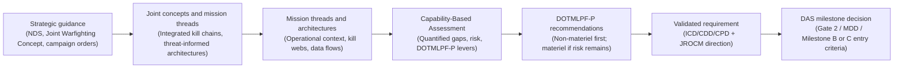

```mermaid
graph LR
    SG["Strategic guidance
    (NDS, Joint Warfighting Concept, campaign orders)"]
    JC["Joint concepts and mission threads
    (Integrated kill chains, threat-informed architectures)"]
    MT["Mission threads and architectures
    (Operational context, kill webs, data flows)"]
    CBA["Capability-Based Assessment
    (Quantified gaps, risk, DOTMLPF-P levers)"]
    DOTM["DOTMLPF-P recommendations
    (Non-materiel first; materiel if risk remains)"]
    VR["Validated requirement
    (ICD/CDD/CPD + JROCM direction)"]
    DAS["DAS milestone decision
    (Gate 2 / MDD / Milestone B or C entry criteria)"]

    SG --> JC --> MT --> CBA --> DOTM --> VR --> DAS
```
