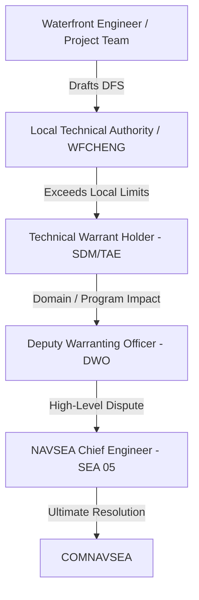

# EDO Qualification Board Study Material: Additional Information (Marci's Notes)

This study material is designed to prepare you for the EDO Qualification Board, specifically addressing the high-yield topics compiled in [2026-06-02-addtional-info.md](../plans/2026-06-02-addtional-info.md). It is cross-referenced with official DoD/Navy instructions and the core study guide LaTeX chapters.

---

## 1. Maintenance (RMCs and Shipyards)
*Primary Source Basis:* [19_Fleet_Maintenance_Assets.tex](../../tex/chapters/19_Fleet_Maintenance_Assets.tex) *and the Joint Fleet Maintenance Manual (JFMM).*

### Levels of Maintenance
Navy maintenance is categorized into three levels, matching the complexity of work to the specialization and capacity of the workforce:
1. **Organizational (O-Level)**: Performed by Ship's Force (crew). Focuses on planned maintenance (PMS) and limited corrective actions (e.g., lubrication, modular change-outs, minor repairs). Purpose: Maximize self-sufficiency.
2. **Intermediate (I-Level)**: Performed by afloat tenders (e.g., submarine tenders) or shore-based intermediate maintenance activities (IMAs/IMFs). Involves routine calibration, gas turbine swap-outs, pump overhauls, corrosion control, and weight testing.
3. **Depot (D-Level)**: Major industrial work requiring specialized facilities (dry docks, heavy shops) and skilled civilian or private workforces. Includes underwater hull work, shaft overhauls, major modernization, and reactor refueling/defueling.

### Public Naval Shipyards
The Navy operates four public shipyards under **NAVSEA 04**, which are government-owned and focus primarily on nuclear-powered aircraft carriers and submarines:
* **Portsmouth Naval Shipyard (PNS)** (Kittery, ME): Specializes in nuclear-powered fast attack submarine (SSN) maintenance, refueling, and modernization.
* **Norfolk Naval Shipyard (NNSY)** (Portsmouth, VA): Specializes in aircraft carrier (CVN) and submarine (SSN/SSBN/SSGN) maintenance, modernization, and inactivation.
* **Puget Sound Naval Shipyard & IMF (PSNS & IMF)** (Bremerton, WA): Specializes in CVN and submarine maintenance, defueling, inactivation, and reactor compartment disposal. *Note: PSNS is the only shipyard that recycles nuclear-powered vessels.*
* **Pearl Harbor Naval Shipyard & IMF (PHNSY & IMF)** (Pearl Harbor, HI): Specializes in submarine maintenance, modernization, and emergent CVN support for the Pacific Fleet.

> [!NOTE]
> **Shipyard Demographics Trap:** FY17 Q1 data highlighted a high concentration of early-career personnel (5 years or less experience) across the public yards: Portsmouth (40.7%), Norfolk (46.2%), Puget Sound (43.3%), and Pearl Harbor (35.8%). Be prepared to discuss training pipelines and supervision challenges.

### Regional Maintenance Centers (RMCs)
Overseen by the **Commander, Navy Regional Maintenance Center (CNRMC)**, the RMCs manage conventional surface ship depot-level maintenance (via private contracts) and provide intermediate military repair and Fleet Technical Assistance (FTA):
* **MARMC** (Mid-Atlantic RMC - Norfolk, VA)
* **SERMC** (Southeast RMC - Mayport, FL)
* **SWRMC** (Southwest RMC - San Diego, CA)
* **FDRMC** (Forward Deployed RMC - Naples, Italy; detachments in Rota, Spain and Manama, Bahrain)
* **NWRMC** (Northwest RMC - Bremerton, WA; co-located and integrated with PSNS & IMF)
* **HRMC** (Hawaii RMC - Pearl Harbor, HI; co-located and integrated with PHNSY & IMF)

### Other Key Waterfront Organizations
* **Ship Repair Facility (SRF/JRMC)** (Yokosuka & Sasebo, Japan): Non-nuclear depot/intermediate facility executing Seventh Fleet emergent repairs and availabilities.
* **Supervisor of Shipbuilding (SUPSHIP)**: Administers new construction, nuclear repair, and modernization contracts at private shipyards (e.g., Electric Boat, Newport News). Acts as the Administrative Contracting Officer (ACO).

### EDO Support Roles on the Waterfront
EDOs bridge the gap between technical standards, business management, and fleet operations:
* **Shipyards**: Serve as Shipyard Commanders (COs), Production Officers, Project Superintendents (managing availability cost/schedule), Quality Assurance Officers, and Chief Test Engineers.
* **RMCs**: Serve as COs, Waterfront Chief Engineers (WFCHENGs), Project Managers, and Contracting Officer's Representatives (CORs).
* **SUPSHIPs**: Serve as Supervisors, Deputy Supervisors, and ACOs managing Navy-builder contracts.

---

## 2. Technical Authority
*Primary Source Basis:* [2_TA_EA.tex](../../tex/chapters/2_TA_EA.tex) *and SECNAVINST 5400.15 series / SECNAVINST 5430.7 series.*

### Definition of Technical Authority (TA)
TA is the authority, responsibility, and accountability to establish, monitor, and approve technical standards, tools, and processes in conformance with higher authority policy. TA is an **inherently governmental function** assigned by SECNAV to SYSCOM commanders.

* **Ultimate TA for Ships/Weapons**: Commander, NAVSEA (COMNAVSEA)
* **Ultimate TA for C4ISR/Cyber/IT**: Commander, NAVWAR (COMNAVWAR)

### Technical Warrant Holders (TWHs)
TWHs are formally warranted individuals with the authority to set and enforce technical standards. Key TWH roles include:
* **Ship Design Manager (SDM)**: Integrates platform-level systems engineering and design.
* **Systems Integration Manager (SIM)**: Coordinates cross-system integration (e.g., combat systems).
* **Cost Engineering Manager (CEM)**: Establishes independent program cost estimates.
* **Technical Area Expert (TAE)**: Domain specialist (e.g., shock, propulsion, structures).
* **Technical Process Owner (TPO)**: Defines standard technical processes.
* **Waterfront Chief Engineer (WFCHENG)**: Leads local technical authority at RMCs, yards, and SUPSHIPs.

### Waterfront Technical Issue Resolution & DFS
When a repair or installation cannot meet official drawings, specifications, or standards, a **Departure from Specification (DFS)** must be submitted:
1. **Waterfront Engineer / Project Team** identifies the issue and drafts the DFS.
2. **Local Technical Authority (LTA) / WFCHENG** adjudicates within delegated local limits.
3. **Technical Warrant Holder (TWH)** (e.g., SDM or TAE at NAVSEA 05) resolves the DFS if it exceeds LTA limits or crosses system boundaries.
4. **Deputy Warranting Officer (DWO)** reviews issues with broad domain or program-level impacts.
5. **NAVSEA Chief Engineer (CHENG, SEA 05)** resolves disputes between DWOs and sets overall policy.
6. **COMNAVSEA** acts as the final TA arbiter.



### Programmatic vs. Technical Disputes
* **Programmatic Authority** (Cost, Schedule, Performance) resides with the Program Manager (PM) and Program Executive Officer (PEO).
* **Technical Authority** (Safety, Standards) resides with the TWH and SYSCOM.
* **Resolution**: A PM **cannot** override a TWH's disapproval of a technical deviation. Disputes must be elevated through their respective chains to the PEO and COMNAVSEA level, and ultimately to **ASN(RD&A)** for final adjudication.
* **Get to Yes Safely**: EDOs must avoid unnecessary "no's" and analysis paralysis. Use engineering judgment to provide safe, realistic, risk-informed alternatives with clear operational boundaries.

> [!WARNING]
> **Why Technical Authority is Required: USS Dolphin (AGSS-555) Case Study**
> On 21 May 2002, USS Dolphin experienced catastrophic flooding and fires. An unauthorized substitution of a black D-shaped sponge gasket for the specified red silicone gasket (made without Technical Authority approval) allowed water to bypass the Mk 54 shield side door in heavy seas. This flooded the spaces, knocked out power, and nearly resulted in the loss of the submarine.

---

## 3. AIT and Installs
*Primary Source Basis:* [22_AIT_Fundamentals_and_Lessons_Learned.tex](../../tex/chapters/22_AIT_Fundamentals_and_Lessons_Learned.tex) *and NAVSEAINST 4720.14 series.*

### Alteration Installation Team (AIT)
An AIT is a dedicated, trained team (military, civilian, or contractor) responsible for installing specific ship changes and alterations across multiple ships. 
* **Advantages**: Specialized skills, highly repeatable quality, and rapid capture of lessons learned across a class.
* **Examples**: CANES (C4ISR), Aegis Weapon System upgrades, GP NTS.

### Key Roles and Waterfront Coordination
* **AIT Sponsor**: Funds and assigns the task (e.g., PEO, PM, TYCOM).
* **AIT Manager**: Plans installation, assigns the team, and designates the OSIC.
* **On-Site Installation Coordinator (OSIC)**: The AIT Manager's representative on-site. Directs the install, coordinates with the shipyard/RMC, and handles QA.
* **Naval Shipbuilding Activity (NSA) / Lead Maintenance Activity (LMA)**: Integrates the availability. Gates AIT access, enforces technical specs, and monitors QA.
* **RMMCO (Regional Maintenance Modernization Coordinating Office)**: The waterfront "gatekeeper" (check-in required **30 days prior** to install). Verifies approved Ship Change Documents (SCDs), Ship Installation Drawings (SIDs), System Operational Verification Test (SOVT) plans, and certified Integrated Logistics Support (ILS) products.

### Memorandum of Agreement (MOA)
An AIT is not self-sufficient. A **MOA** must be signed by **A-1** (one day before availability start) between the LMA, AIT Manager, Ship's Force, and NSA. It governs tag-out controls, safety, working hours, fire protocols, and support services.

### Product Line Integration Walkthrough (12 Steps)
```
[System Production] 
       ↓
[Factory Acceptance Testing (FAT)] 
       ↓
[Staging & Delivery] 
       ↓
[NMP & SCD Approval] (SCD approved by PM & TWH)
       ↓
[Installation Package Development] (SIDs & SOVT drafted)
       ↓
[RMMCO Gatekeeping] (Check-in 30 days prior to install)
       ↓
[Waterfront Coordination] (MOA signed at A-1)
       ↓
[Physical Installation] (AIT executes structural/cabling work)
       ↓
[System Testing] (SOVT executed by AIT & Ship's Force)
       ↓
[QA & Certification] (NSA/OSIC sign completion paperwork)
       ↓
[Logistics Handover] (Manuals, spares, APLs turned over to crew)
       ↓
[Configuration Update] (CDMD-OA updated within 30 days)
```

### Modernization Differences by Class
* **Conventional Surface Ships**: Standard Navy Modernization Process (NMP) driven by SCDs and gated on the waterfront by RMMCO.
* **Submarines and Nuclear Vessels**: Extremely rigid boundaries. Alterations inside **SUBSAFE, Fly-By-Wire, or Nuclear (NAVSEA 08)** boundaries require certified activities (e.g., public yards) and strict double-signature QA audits.
* **Temporary Alterations (TempAlts)**: Submarine TempAlts are strictly time-bound, tracked on active status lists, and must be uninstalled before the approved expiration date.
* **ISEA Involvement**: The In-Service Engineering Activity (ISEA) serves as the lifecycle engineering agent. They write the SIDs and SOVTs, ensure ILS product availability, and provide technical oversight.

---

## 4. Testing
*Primary Source Basis:* [18B_test-eval.tex](../../tex/chapters/18B_test-eval.tex) *and DoDI 5000.89 / DoDI 5000.98.*

### Verification vs. Validation
Testing in the Navy focuses on answering two core questions:
* **"Did we build the thing right?" $\rightarrow$ Verification (Developmental Testing / DT&E)**: Evaluates the system against documented technical specifications, drawings, and baseline standards.
* **"Did we build the right thing?" $\rightarrow$ Validation (Operational Testing / OT&E)**: Evaluates the system in a realistic operational environment, using representative operators, against warfighting capability requirements (KPPs/KSAs).

| Attribute | Developmental Test & Evaluation (DT&E) | Operational Test & Evaluation (OT&E) |
| --- | --- | --- |
| **Purpose** | Engineering feedback loop; finds design & reliability errors early. | Readiness judgment; determines operational effectiveness & suitability. |
| **Led By** | Program Manager, Chief Developmental Tester (CDT), Lead DT Organization (LDTO). | Independent Operational Test Agency (OTA) – e.g., **COMOPTEVFOR**. |
| **Environment** | Controlled labs, test ranges, digital threads, land-based sites. | Realistic threat environments, representative fleet operators, operational constraints. |
| **Timing** | Starts early (MSA/TMRR) and runs through EMD. | Conducted on production-representative articles prior to FRP (IOT&E). |

### Statutory Roles and Requirements
* **DOT&E (10 U.S.C. 139)**: The Director, Operational Test and Evaluation is the independent statutory advisor to the SECDEF and Congress. DOT&E:
  * Approves operational test plans and live-fire test strategies for all covered programs.
  * Monitors operational and live-fire test execution.
  * Submits independent adequacy and operational capability assessment reports directly to Congress, SECDEF, and the MDA before a program can proceed beyond LRIP or enter full-rate production.
* **10 U.S.C. 4171**: Requires covered programs to complete adequate operational test and evaluation before proceeding beyond LRIP.
* **10 U.S.C. 4172 (LFT&E)**: Mandates Live Fire Test & Evaluation (survability/lethality testing) for covered crew-occupied platforms and munitions before full-rate production. Waivers require SECDEF approval and congressional notification.

### Navy independent Operational Test Agency (OTA)
**COMOPTEVFOR** (Commander, Operational Test and Evaluation Force) reports directly to the CNO to maintain independence from program offices and PEOs:
* Plans and executes independent Navy OT&E.
* Assesses operational effectiveness (can the system complete the mission?) and operational suitability (reliability, maintainability, training, supportability).
* Serves as the sole certification authority for the **Operational Test Readiness Review (OTRR)** to certify that a program is ready for OPEVAL.
* Recommends restricted Fleet release to the CNO and MDA if Category I deficiencies remain.

---

## 5. Other Notes (PPBE and SE Reviews)
*Primary Source Basis:* [6_PPBE.tex](../../tex/chapters/6_PPBE.tex) *and [17I_CM_and_Technical_Reviews.tex](../../tex/chapters/17I_CM_and_Technical_Reviews.tex).*

### Planning, Programming, Budgeting, and Execution (PPBE)
PPBE is the calendar-driven resource allocation process that funds the DoD.

```
[Planning] ───────────► [Programming] ───────────► [Budgeting] ───────────► [Execution]
Strategic priorities    POM development (5 years)  BES development (1 year)   Obligation & Reprogramming
(Outputs: CPR, DPG)     (Signed by SECNAV)         (Signed by FMB/N82)        (Mid-year reviews)
```

### OPNAV Resource Sponsors
* **N1**: Manpower, Personnel, Training, and Education.
* **N2/N6**: Information Warfare.
* **N3/N5**: Navy Warfare Development / Operations.
* **N4**: Afloat and Shore Readiness.
* **N8**: **Integrator** of Navy capabilities and resources (N80 builds/integrates the POM; N81 conducts assessments). *Note: N8 is the "checkbook" integrator, not a platform sponsor.*
* **N9**: Warfare Systems Resource-Sponsor Family:
  * **N94**: Test & Evaluation
  * **N95**: Expeditionary Warfare
  * **N96**: Surface Warfare
  * **N97**: Undersea Warfare
  * **N98**: Air Warfare
  * **N99**: Unmanned Warfare Systems
  * **N9I/9I**: Integrated Warfare (cross-portfolio integration)

### FMB / N82 (DASN Budget / Fiscal Management Division)
FMB/N82 manages the Navy budgeting and execution-control arm:
* Converts the programming POM into the **Budget Estimate Submission (BES)**.
* Defends Navy estimates through OSD and OMB hearings.
* Responds to Program Budget Decisions (PBDs) and Congressional marks via **reclamas**.
* Manages appropriation execution (RDT&E, SCN, O&N, etc.) and obligations.

### Systems Engineering Reviews
SE reviews are event-driven maturity gates that align configuration baselines to the acquisition lifecycle:

| Review | Phase | Primary Baseline / Focus | EDO Board-Prep Purpose |
| --- | --- | --- | --- |
| **ASR** (Alternative System Review) | MSA | Preferred Material Solution | Feasibility, affordability, and initial system concepts. |
| **SRR** (System Requirements Review) | TMRR | System Requirements | Verifies traceable and testable system requirements. |
| **SFR** (System Functional Review) | TMRR | Functional Baseline | Verifies functional architecture satisfies requirements. |
| **PDR** (Preliminary Design Review) | TMRR | **Allocated Baseline** | Verifies preliminary design is mature enough for detailed design. |
| **CDR** (Critical Design Review) | EMD | **Initial Product Baseline** | Confirms design stability; ready to start fabrication/coding. |
| **TRR** (Test Readiness Review) | EMD | Test Readiness | Verifies test assets, safety, and procedures are ready for test. |
| **SVR / FCA** (System Verification Review) | EMD | Verification | Verifies system meets functional/allocated baseline requirements. |
| **PRR** (Production Readiness Review) | EMD/P&D| Production Readiness | Assesses manufacturing plans, quality, and supply chain prior to LRIP. |
| **OTRR** (Operational Test Readiness Review) | P&D | Operational Readiness | COMOPTEVFOR certification that the system is ready for OPEVAL. |
| **PCA** (Physical Configuration Audit) | P&D | **Final Product Baseline** | Audits the "as-built" production item against documentation. |
