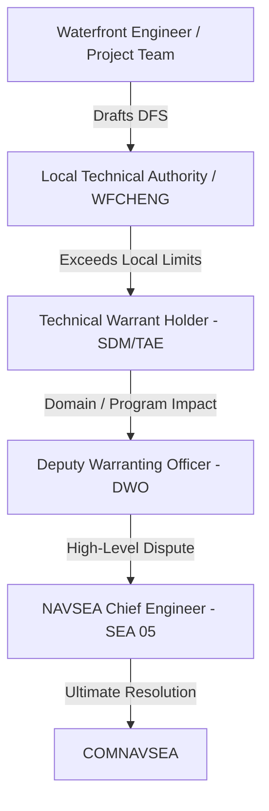

# EDO Qualification Board Study Material

This study material is designed to prepare you for the EDO Qualification Board, specifically addressing the high-yield
topics compiled in [2026-06-02-addtional-info.md](../plans/2026-06-02-addtional-info.md). It is cross-referenced with
official DoD/Navy instructions and the core study guide LaTeX chapters.

---

## 1. Maintenance (RMCs and Shipyards)

*Primary Source Basis:* [19_Fleet_Maintenance_Assets.tex](../../tex/chapters/19_Fleet_Maintenance_Assets.tex)
*and the Joint Fleet Maintenance Manual (JFMM).*

### Levels of Maintenance

Navy maintenance is categorized into three levels, matching the complexity of work to the specialization and capacity of
the workforce:

1. **Organizational (O-Level)**: Performed by Ship's Force (crew). Focuses on planned maintenance (PMS) and limited
   corrective actions (e.g., lubrication, modular change-outs, minor repairs). Purpose: Maximize self-sufficiency.
2. **Intermediate (I-Level)**: Performed by afloat tenders (e.g., submarine tenders) or shore-based intermediate
   maintenance activities (IMAs/IMFs). Involves routine calibration, gas turbine swap-outs, pump overhauls, corrosion
   control, and weight testing.
3. **Depot (D-Level)**: Major industrial work requiring specialized facilities (dry docks, heavy shops) and skilled
   civilian or private workforces. Includes underwater hull work, shaft overhauls, major modernization, and reactor
   refueling/defueling.

### Public Naval Shipyards

The Navy operates four public shipyards under **NAVSEA 04**, which are government-owned and focus primarily on
nuclear-powered aircraft carriers and submarines:

* **Portsmouth Naval Shipyard (PNS)** (Kittery, ME): Specializes in nuclear-powered fast attack submarine (SSN)
  maintenance, refueling, and modernization.
* **Norfolk Naval Shipyard (NNSY)** (Portsmouth, VA): Specializes in aircraft carrier (CVN) and submarine
  (SSN/SSBN/SSGN) maintenance, modernization, and inactivation.
* **Puget Sound Naval Shipyard & IMF (PSNS & IMF)** (Bremerton, WA): Specializes in CVN and submarine maintenance,
  defueling, inactivation, and reactor compartment disposal.
  *Note: PSNS is the only shipyard that recycles nuclear-powered vessels.*
* **Pearl Harbor Naval Shipyard & IMF (PHNSY & IMF)** (Pearl Harbor, HI): Specializes in submarine maintenance,
  modernization, and emergent CVN support for the Pacific Fleet.

> [!NOTE]
> **Shipyard Demographics Trap:** FY17 Q1 data highlighted a high concentration of early-career personnel (5 years or
> less experience) across the public yards: Portsmouth (40.7%), Norfolk (46.2%), Puget Sound (43.3%), and Pearl Harbor
> (35.8%). Be prepared to discuss training pipelines and supervision challenges.

### Regional Maintenance Centers (RMCs)

Overseen by the **Commander, Navy Regional Maintenance Center (CNRMC)**, the RMCs manage conventional surface ship
depot-level maintenance (via private contracts) and provide intermediate military repair and Fleet Technical Assistance
(FTA):

* **MARMC** (Mid-Atlantic RMC - Norfolk, VA)
* **SERMC** (Southeast RMC - Mayport, FL)
* **SWRMC** (Southwest RMC - San Diego, CA)
* **FDRMC** (Forward Deployed RMC - Naples, Italy; detachments in Rota, Spain and Manama, Bahrain)
* **NWRMC** (Northwest RMC - Bremerton, WA; co-located and integrated with PSNS & IMF)
* **HRMC** (Hawaii RMC - Pearl Harbor, HI; co-located and integrated with PHNSY & IMF)

### Other Key Waterfront Organizations

* **Ship Repair Facility (SRF/JRMC)** (Yokosuka & Sasebo, Japan): Non-nuclear depot/intermediate facility executing
  Seventh Fleet emergent repairs and availabilities.
* **Supervisor of Shipbuilding (SUPSHIP)**: Administers new construction, nuclear repair, and modernization contracts at
  private shipyards (e.g., Electric Boat, Newport News). Acts as the Administrative Contracting Officer (ACO).

### EDO Support Roles on the Waterfront

EDOs bridge the gap between technical standards, business management, and fleet operations:

* **Shipyards**: Serve as Shipyard Commanders (COs), Production Officers, Project Superintendents (managing availability
  cost/schedule), Quality Assurance Officers, and Chief Test Engineers.
* **RMCs**: Serve as COs, Waterfront Chief Engineers (WFCHENGs), Project Managers, and Contracting Officer's
  Representatives (CORs).
* **SUPSHIPs**: Serve as Supervisors, Deputy Supervisors, and ACOs managing Navy-builder contracts.

---

## 2. Technical Authority

*Primary Source Basis:* [2_TA_EA.tex](../../tex/chapters/2_TA_EA.tex)
*and SECNAVINST 5400.15 series / SECNAVINST 5430.7 series.*

### Definition of Technical Authority (TA)

TA is the authority, responsibility, and accountability to establish, monitor, and approve technical standards, tools,
and processes in conformance with higher authority policy. TA is an **inherently governmental function** assigned by
SECNAV to SYSCOM commanders.

* **Ultimate TA for Ships/Weapons**: Commander, NAVSEA (COMNAVSEA)
* **Ultimate TA for C4ISR/Cyber/IT**: Commander, NAVWAR (COMNAVWAR)

### Technical Warrant Holders (TWHs)

TWHs are formally warranted individuals with the authority to set and enforce technical standards. Key TWH roles
include:

* **Ship Design Manager (SDM)**: Integrates platform-level systems engineering and design.
* **Systems Integration Manager (SIM)**: Coordinates cross-system integration (e.g., combat systems).
* **Cost Engineering Manager (CEM)**: Establishes independent program cost estimates.
* **Technical Area Expert (TAE)**: Domain specialist (e.g., shock, propulsion, structures).
* **Technical Process Owner (TPO)**: Defines standard technical processes.
* **Waterfront Chief Engineer (WFCHENG)**: Leads local technical authority at RMCs, yards, and SUPSHIPs.

### Waterfront Technical Issue Resolution & DFS

When a repair or installation cannot meet official drawings, specifications, or standards, a
**Departure from Specification (DFS)** must be submitted:

1. **Waterfront Engineer / Project Team** identifies the issue and drafts the DFS.
2. **Local Technical Authority (LTA) / WFCHENG** adjudicates within delegated local limits.
3. **Technical Warrant Holder (TWH)** (e.g., SDM or TAE at NAVSEA 05) resolves the DFS if it exceeds LTA limits or
   crosses system boundaries.
4. **Deputy Warranting Officer (DWO)** reviews issues with broad domain or program-level impacts.
5. **NAVSEA Chief Engineer (CHENG, SEA 05)** resolves disputes between DWOs and sets overall policy.
6. **COMNAVSEA** acts as the final TA arbiter.



### Programmatic vs. Technical Disputes

* **Programmatic Authority** (Cost, Schedule, Performance) resides with the Program Manager (PM) and Program Executive
  Officer (PEO).
* **Technical Authority** (Safety, Standards) resides with the TWH and SYSCOM.
* **Resolution**: A PM **cannot** override a TWH's disapproval of a technical deviation. Disputes must be elevated
  through their respective chains to the PEO and COMNAVSEA level, and ultimately to **ASN(RD&A)** for final
  adjudication.
* **Get to Yes Safely**: EDOs must avoid unnecessary "no's" and analysis paralysis. Use engineering judgment to provide
  safe, realistic, risk-informed alternatives with clear operational boundaries.

> [!WARNING]
> **Why Technical Authority is Required: USS Dolphin (AGSS-555) Case Study** On 21 May 2002, USS Dolphin experienced
> catastrophic flooding and fires. An unauthorized substitution of a black D-shaped sponge gasket for the specified red
> silicone gasket (made without Technical Authority approval) allowed water to bypass the Mk 54 shield side door in
> heavy seas. This flooded the spaces, knocked out power, and nearly resulted in the loss of the submarine.

---

## 3. AIT and Installs

*Primary Source Basis:*
[22_AIT_Fundamentals_and_Lessons_Learned.tex](../../tex/chapters/22_AIT_Fundamentals_and_Lessons_Learned.tex)
*and NAVSEAINST 4720.14 series.*

### Alteration Installation Team (AIT)

An AIT is a dedicated, trained team (military, civilian, or contractor) responsible for installing specific ship changes
and alterations across multiple ships.

* **Advantages**: Specialized skills, highly repeatable quality, and rapid capture of lessons learned across a class.
* **Examples**: CANES (C4ISR), Aegis Weapon System upgrades, GP NTS.

### Key Roles and Waterfront Coordination

* **AIT Sponsor**: Funds and assigns the task (e.g., PEO, PM, TYCOM).
* **AIT Manager**: Plans installation, assigns the team, and designates the OSIC.
* **On-Site Installation Coordinator (OSIC)**: The AIT Manager's representative on-site. Directs the installation,
  coordinates with the shipyard/RMC, and handles QA.
* **Naval Shipbuilding Activity (NSA) / Lead Maintenance Activity (LMA)**: Integrates the availability. Gates AIT
  access, enforces technical specs, and monitors QA.
* **RMMCO (Regional Maintenance Modernization Coordinating Office)**: The waterfront "gatekeeper" (check-in required
  **30 days prior** to install). Verifies approved Ship Change Documents (SCDs), Ship Installation Drawings (SIDs),
  System Operational Verification Test (SOVT) plans, and certified Integrated Logistics Support (ILS) products.

### Memorandum of Agreement (MOA)

An AIT is not self-sufficient. A **MOA** must be signed by **A-1** (one day before availability start) between the LMA,
AIT Manager, Ship's Force, and NSA. It governs tag-out controls, safety, working hours, fire protocols, and support
services.

### Product Line Integration Walkthrough (12 Steps)

```text
[System Production] 
       ↓
[Factory Acceptance Testing (FAT)] 
       ↓
[Staging & Delivery] 
       ↓
[NMP & SCD Approval] (SCD approved by PM & TWH)
       ↓
[Installation Package Development] (SIDs & SOVT drafted)
       ↓
[RMMCO Gatekeeping] (Check-in 30 days prior to install)
       ↓
[Waterfront Coordination] (MOA signed at A-1)
       ↓
[Physical Installation] (AIT executes structural/cabling work)
       ↓
[System Testing] (SOVT executed by AIT & Ship's Force)
       ↓
[QA & Certification] (NSA/OSIC sign completion paperwork)
       ↓
[Logistics Handover] (Manuals, spares, APLs turned over to crew)
       ↓
[Configuration Update] (CDMD-OA updated within 30 days)
```

### Modernization Differences by Class

* **Conventional Surface Ships**: Standard Navy Modernization Process (NMP) driven by SCDs and gated on the waterfront
  by RMMCO.
* **Submarines and Nuclear Vessels**: Extremely rigid boundaries. Alterations inside
  **SUBSAFE, Fly-By-Wire, or Nuclear (NAVSEA 08)** boundaries require certified activities (e.g., public yards) and
  strict double-signature QA audits.
* **Temporary Alterations (TempAlts)**: Submarine TempAlts are strictly time-bound, tracked on active status lists, and
  must be uninstalled before the approved expiration date.
* **ISEA Involvement**: The In-Service Engineering Activity (ISEA) serves as the lifecycle engineering agent. They write
  the SIDs and SOVTs, ensure ILS product availability, and provide technical oversight.

---

## 4. Testing

*Primary Source Basis:* [18B_test-eval.tex](../../tex/chapters/18B_test-eval.tex) *and DoDI 5000.89 / DoDI 5000.98.*

### Verification vs. Validation

Testing in the Navy focuses on answering two core questions:

* **"Did we build the thing right?" $\rightarrow$ Verification (Developmental Testing / DT&E)**: Evaluates the system
  against documented technical specifications, drawings, and baseline standards.
* **"Did we build the right thing?" $\rightarrow$ Validation (Operational Testing / OT&E)**: Evaluates the system in a
  realistic operational environment, using representative operators, against warfighting capability requirements
  (KPPs/KSAs).

| Attribute       | Developmental Test & Evaluation (DT&E)                                          | Operational Test & Evaluation (OT&E)                                                    |
| --------------- | ------------------------------------------------------------------------------- | --------------------------------------------------------------------------------------- |
| **Purpose**     | Engineering feedback loop; finds design & reliability errors early.             | Readiness judgment; determines operational effectiveness & suitability.                 |
| **Led By**      | Program Manager, Chief Developmental Tester (CDT), Lead DT Organization (LDTO). | Independent Operational Test Agency (OTA) - e.g., **OPTEVFOR/COMOPTEVFOR**.             |
| **Environment** | Controlled labs, test ranges, digital threads, land-based sites.                | Realistic threat environments, representative fleet operators, operational constraints. |
| **Timing**      | Starts early (MSA/TMRR) and runs through EMD.                                   | Conducted on production-representative articles prior to FRP (IOT&E).                   |

### Statutory Roles and Requirements

* **DOT&E (10 U.S.C. 139)**: The Director, Operational Test and Evaluation is the independent statutory advisor to the
  SECDEF and Congress. DOT&E:
  * Approves operational test plans and live-fire test strategies for all covered programs.
  * Monitors operational and live-fire test execution.
  * Submits independent adequacy and operational capability assessment reports directly to Congress, SECDEF, and the MDA
    before a program can proceed beyond LRIP or enter full-rate production.
* **10 U.S.C. 4171**: Requires covered programs to complete adequate operational test and evaluation before proceeding
  beyond LRIP.
* **10 U.S.C. 4172 (LFT&E)**: Mandates Live Fire Test & Evaluation (survability/lethality testing) for covered
  crew-occupied platforms and munitions before full-rate production. Waivers require SECDEF approval and congressional
  notification.

### Navy Independent Operational Test Agency (OTA)

**OPTEVFOR** (Operational Test and Evaluation Force, still commonly tested on boards as **COMOPTEVFOR**, the commander
acronym) reports directly to the CNO to maintain independence from program offices and PEOs:

* Plans and executes independent Navy OT&E.
* Assesses operational effectiveness (can the system complete the mission?) and operational suitability (reliability,
  maintainability, training, supportability).
* Serves as the sole certification authority for the **Operational Test Readiness Review (OTRR)** to certify that a
  program is ready for OPEVAL.
* Recommends restricted Fleet release to the CNO and MDA if Category-I deficiencies remain.

---

## 5. Other Notes (PPBE, MCA, and SE Reviews)

*Primary Source Basis:* [6_PPBE.tex](../../tex/chapters/6_PPBE.tex),
[9_Program_Funding_and_Execution.tex](../../tex/chapters/9_Program_Funding_and_Execution.tex),
[16_Milestones.tex](../../tex/chapters/16_Milestones.tex), *and*
[17I_CM_and_Technical_Reviews.tex](../../tex/chapters/17I_CM_and_Technical_Reviews.tex).

### Planning, Programming, Budgeting, and Execution (PPBE)

PPBE is the calendar-driven resource allocation process that funds the DoD.

```text
[Planning] ───────────► [Programming] ───────────► [Budgeting] ───────────► [Execution]
Strategic priorities    POM development (5 years)  BES development (1 year)   Obligation & Reprogramming
(Outputs: CPR, DPG)     (Signed by SECNAV)         (Signed by FMB/N82)        (Mid-year reviews)
```

### OPNAV Resource Sponsors

* **N1**: Manpower, Personnel, Training, and Education.
* **N2/N6**: Information Warfare.
* **N3/N5**: Navy Warfare Development / Operations.
* **N4**: Afloat and Shore Readiness.
* **N8**: **Integrator** of Navy capabilities and resources (N80 builds/integrates the POM; N81 conducts assessments).
  *Note: N8 is the "checkbook" integrator, not a platform sponsor.*
* **N9**: Warfare Systems Resource-Sponsor Family:
  * **N94**: Test & Evaluation
  * **N95**: Expeditionary Warfare
  * **N96**: Surface Warfare
  * **N97**: Undersea Warfare
  * **N98**: Air Warfare
  * **N99**: Unmanned Warfare Systems
  * **N9I/9I**: Integrated Warfare (cross-portfolio integration)

### FMB / N82 (DASN Budget / Fiscal Management Division)

FMB/N82 manages the Navy budgeting and execution-control arm:

* Converts the programming POM into the **Budget Estimate Submission (BES)**.
* Defends Navy estimates through OSD and OMB hearings.
* Responds to Program Budget Decisions (PBDs) and Congressional marks via **reclamas**.
* Manages appropriation execution (RDT&E, SCN, O&MN, etc.) and obligations.

### Systems Engineering Reviews

SE reviews are event-driven maturity gates that align configuration baselines to the acquisition lifecycle:

| Review                                       | Phase   | Primary Baseline / Focus     | EDO Board-Prep Purpose                                                  |
| -------------------------------------------- | ------- | ---------------------------- | ----------------------------------------------------------------------- |
| **ASR** (Alternative System Review)          | MSA     | Preferred Material Solution  | Feasibility, affordability, and initial system concepts.                |
| **SRR** (System Requirements Review)         | TMRR    | System Requirements          | Verifies traceable and testable system requirements.                    |
| **SFR** (System Functional Review)           | TMRR    | Functional Baseline          | Verifies functional architecture satisfies requirements.                |
| **PDR** (Preliminary Design Review)          | TMRR    | **Allocated Baseline**       | Verifies preliminary design is mature enough for detailed design.       |
| **CDR** (Critical Design Review)             | EMD     | **Initial Product Baseline** | Confirms design stability; ready to start fabrication/coding.           |
| **TRR** (Test Readiness Review)              | EMD     | Test Readiness               | Verifies test assets, safety, and procedures are ready for test.        |
| **SVR / FCA** (System Verification Review)   | EMD     | Verification                 | Verifies system meets functional/allocated baseline requirements.       |
| **PRR** (Production Readiness Review)        | EMD/P&D | Production Readiness         | Assesses manufacturing plans, quality, and supply chain prior to LRIP.  |
| **OTRR** (Operational Test Readiness Review) | P&D     | Operational Readiness        | OPTEVFOR/COMOPTEVFOR certification that the system is ready for OPEVAL. |
| **PCA** (Physical Configuration Audit)       | P&D     | **Final Product Baseline**   | Audits the "as-built" production item against documentation.            |

### MCA Pathway Board Flow

The **Major Capability Acquisition (MCA) pathway** is the deliberate acquisition path for complex defense programs that
need mature requirements, disciplined milestone decisions, engineering maturity, production readiness, sustainment
planning, and formal T&E before large-scale fielding.

**Board answer flow:** validated gap or need → MDD → MSA → Milestone A → TMRR → Development RFP Release →
Milestone B → EMD → Milestone C → P&D / LRIP → IOT&E → FRP/FD → O&S.

| Event                       | Purpose                                                                                                              | Typical Board Entry/Exit Logic                                                                                                                                                                        | Major Players                                                                                                    |
| --------------------------- | -------------------------------------------------------------------------------------------------------------------- | ----------------------------------------------------------------------------------------------------------------------------------------------------------------------------------------------------- | ---------------------------------------------------------------------------------------------------------------- |
| **MDD**                     | Authorizes entry into the MCA process and normally starts **`Materiel Solution Analysis` (MSA)**.                    | Entry is a validated requirements document such as an ICD or equivalent need, plus AoA study guidance/plan. Exit is MDA authorization to analyze `materiel` solutions.                                | MDA, sponsor/resource sponsor, requirements authority, DCAPE or component cost/AoA lead, CAE/PEO/PM as assigned. |
| **MSA / AoA**               | Compares `materiel` alternatives for cost, schedule, performance, risk, and affordability.                           | Outputs include the preferred `materiel` solution, AoA results, acquisition strategy input, and risk understanding for Milestone A.                                                                   | PM/PEO, sponsor, cost estimators, T&E, engineering, sustainment, contracting, user/fleet reps.                   |
| **Milestone A**             | Authorizes **Technology Maturation and Risk Reduction (TMRR)**.                                                      | Board focus: is there a viable preferred solution, a risk-reduction plan, affordability basis, and enough funding to mature technology and requirements?                                              | MDA, CAE/PEO/PM, requirements authority, engineering/TA, T&E, comptroller, contracting, sustainment.             |
| **TMRR**                    | Reduces technical risk, matures the design enough for development, and matures the draft CDD into a validated CDD.   | Exit requires enough design/requirements maturity to release the development RFP and support Milestone B.                                                                                             | PM/PEO, industry competitors, systems engineering, T&E, requirements sponsor, TA/TWH, contracting.               |
| **Development RFP Release** | Locks enough of the government strategy to release the EMD solicitation.                                             | The validated CDD should precede this decision. The ADM should identify criteria for Milestone C, including T&E, affordability, sustainment metrics, LRIP/limited deployment scope, and FYDP funding. | MDA, PM/PEO, contracting, legal, engineering, T&E, cost, sustainment, requirements authority.                    |
| **Milestone B**             | Authorizes **Engineering and Manufacturing Development (EMD)** and usually establishes the formal Program of Record. | Board focus: validated CDD, APB, acquisition strategy, funding in the FYDP, T&E strategy/TEMP, risk posture, affordability, and executable EMD contract strategy.                                     | MDA, CAE/PEO/PM, resource sponsor, comptroller, contracting, T&E, engineering/TA, sustainment, user/fleet reps.  |
| **EMD**                     | Completes detailed design, builds/test articles, verifies design, and prepares for production.                       | Exit logic is production-representative maturity, completed/adequate DT, readiness for OT, stable product baseline, and producibility/sustainment readiness.                                          | PM/PEO, contractor, LSE, CDT, OTA, TWH/TA, ISEA, production/logistics teams.                                     |
| **Milestone C**             | Authorizes Production and Deployment, usually LRIP or limited deployment first.                                      | Board focus: production readiness, test results, supportability, manufacturing maturity, risk, affordability, and the plan to get to IOT&E/FRP.                                                       | MDA, PM/PEO, production/logistics, T&E, comptroller, contracting, fleet/user reps.                               |
| **FRP/FD Decision**         | Approves full-rate production or full deployment after adequate operational test evidence.                           | DOT&E provides its independent report for MDAPs and DOT&E oversight programs before proceeding beyond LRIP.                                                                                           | MDA, DOT&E, OTA/OPTEVFOR, PM/PEO, fleet/user reps, sustainment and production stakeholders.                      |

### Command Relationships: ADCON, OPCON, and Acquisition

**ADCON** is the administrative/service chain: organize, train, equip, man, maintain, discipline, sustain, and resource
forces. In acquisition language, ADCON is where the Navy's Title 10 "equip and sustain" responsibility lives through
SECNAV/CNO, ASN(RD&A), SYSCOMs, PEOs, warfare centers, shipyards, RMCs, and program offices.

**OPCON** is the operational-employment chain: commanders use assigned or allocated forces to accomplish missions. In
acquisition language, OPCON fleet commanders are not normally the PM's acquisition chain, but they are the operational
customer whose mission needs, CASREPs, TYCOM priorities, fleet feedback, test participation, and availability
constraints shape requirements, modernization priorities, and fielding decisions.

**Board line:** acquisition is resourced and executed through the ADCON/provider side, but it must deliver capability
that the OPCON/fleet side can actually employ, maintain, train to, and fight with.

### Flow of a Dollar

PPBE is the planning and resource-allocation process; execution is where the money becomes legally available, obligated,
expended, and finally outlayed. A board answer should separate **who asks for money**,
**who provides budget authority**, and **who legally obligates it**.

1. **Need is identified** by the fleet, sponsor, program office, or sustainment enterprise.
2. **Planning and programming** translate that need into program content through sponsor/N8/FMB/PEO/PM coordination and
   the POM/BES cycle.
3. **Congress authorizes and appropriates** budget authority by purpose, time, and amount.
4. **OMB apportions** appropriated funds; DoD Comptroller distributes funds to Military Departments and defense
   agencies.
5. **DON/FMB and Navy comptroller channels allot/sub-allot** funds to SYSCOMs, PEOs, PMs, yards, or other execution
   activities.
6. **PM/contracting/field activity commits** funds internally for a planned action.
7. **Contracting or ordering authority obligates** funds by contract, order, MIPR, project order, or work authorization.
8. **Vendor or performing activity delivers** goods/services and invoices.
9. **Government accepts and expends** funds when payment is made against the obligation.
10. **Treasury outlays** cash from the government.

**Statutory guardrails:** 31 U.S.C. 1301 is the purpose rule; 31 U.S.C. 1502 is the time/bona-fide-need rule; 31 U.S.C.
1341 is the amount/Anti-Deficiency rule. For a board answer, say: "right color, right year, right amount."

---

## 6. Warfare Centers, Supply, and Fleet Fielding

*Primary Source Basis:* [3_NAVSEA.tex](../../tex/chapters/3_NAVSEA.tex),
[17J_Acquisition_Logistics.tex](../../tex/chapters/17J_Acquisition_Logistics.tex),
[20_Navy_Modernization_Program.tex](../../tex/chapters/20_Navy_Modernization_Program.tex),
[22_AIT_Fundamentals_and_Lessons_Learned.tex](../../tex/chapters/22_AIT_Fundamentals_and_Lessons_Learned.tex),
[26_CNO_Availability_Execution.tex](../../tex/chapters/26_CNO_Availability_Execution.tex), NAVSEA Warfare Centers
official pages, NAVSUP WSS official pages, and NAVSEA Standard Items.*

### NAVSEA Warfare Centers Quick Map

The warfare centers are NAVSEA's technical depth: RDT&E, engineering, test, assessment, in-service engineering,
depot/industrial support, logistics, and fleet technical support. Their primary customers are NAVSEA, PEOs, program
offices, fleet/TYCOMs, shipyards/RMCs, joint customers, and allied partners depending on the product line.

| Warfare Center          | Main Location                                  | Product / Board Cue                                                                                                                       | Major Customers                                                                            |
| ----------------------- | ---------------------------------------------- | ----------------------------------------------------------------------------------------------------------------------------------------- | ------------------------------------------------------------------------------------------ |
| **`NSWC Carderock`**    | West Bethesda, MD, with detachments            | Ship design, naval architecture, hydrodynamics, signatures, structures, combatant craft, platform engineering.                            | NAVSEA, Team Ships, Team Subs, shipyards, fleet.                                           |
| **`NSWC Corona`**       | Corona, CA                                     | Independent assessment, analytics, data-driven performance assessment, readiness measurement, metrology/calibration.                      | Fleet, NAVSEA, PEOs, warfare commanders.                                                   |
| **`NSWC Crane`**        | Crane, IN                                      | Electromagnetic warfare, expeditionary warfare systems, strategic systems components, sensors/electronics sustainment.                    | NAVSEA, NAVWAR/NAVAIR partners, strategic systems, special operations and fleet customers. |
| **`NSWC Dahlgren`**     | Dahlgren, VA, with Dam Neck Activity           | Surface ship weapons-system development and integration, combat-system integration, missile defense, directed energy and weapons control. | PEO IWS, surface fleet, joint and homeland defense customers.                              |
| **`NSWC Indian Head`**  | Indian Head, MD                                | Energetics, ordnance, explosives, propellants, EOD technologies, energetics manufacturing/industrial base.                                | Navy, joint ordnance/EOD, PEOs, fleet.                                                     |
| **`NSWC Panama City`**  | Panama City, FL                                | Mine warfare, littoral warfare systems, amphibious/expeditionary systems, diving and life-support systems.                                | Expeditionary, mine warfare, special warfare, fleet and PEO customers.                     |
| **`NSWC Philadelphia`** | Philadelphia, PA                               | Surface and undersea machinery, power, controls, auxiliary ship systems, machinery cybersecurity/control systems.                         | NAVSEA, shipyards/RMCs, Team Ships, Team Subs, fleet.                                      |
| **`NSWC Port Hueneme`** | Port Hueneme, CA                               | Surface-warfare combat-system in-service engineering, integration, T&E, logistics, product support.                                       | PEO IWS, surface fleet, Aegis/combat-system program offices.                               |
| **`NUWC Keyport`**      | Keyport, WA, with Pacific detachments and NSLC | Undersea warfare sustainment, undersea ranges, test/evaluation, fielding and maintenance for undersea systems and vehicles.               | Team Subs, PEO UWS, submarine force, allied undersea customers.                            |
| **`NUWC Newport`**      | Newport, RI                                    | Full-spectrum undersea RDT&E, engineering, T&E, fleet support for submarine and undersea battlespace systems.                             | Team Subs, PEO UWS, submarine force, undersea warfare customers.                           |

### Navy Supply Repair-Parts Walkthrough

When a ship or submarine needs repair parts, the flow is operational need → requisition → inventory/source decision →
contracting/repair action if required → delivery → configuration/logistics update.

**Board answer flow:**

1. Ship's Force, yard, RMC, or ISEA identifies the material need using the technical manual, APL/AEL/COSAL, allowance,
   maintenance requirement, CASREP, or availability work package.
2. Supply submits the requisition through Navy supply systems; priority depends on mission impact, CASREP status,
   availability schedule, and required delivery date.
3. **NAVSUP WSS** provides weapon-system supply support and centrally manages hundreds of thousands of
   repair-part/component line items for ships, submarines, aircraft, and weapon systems.
4. If material is available, it moves through the Navy/DoD logistics network to the ship, tender, yard, RMC, or
   contractor.
5. If material is not available, supply and engineering coordinate alternatives: lateral redistribution, repairables,
   cannibalization authority when approved, local procurement, DLA/common-item sourcing, vendor buy, organic repair, or
   engineering disposition for obsolete/DMSMS parts.
6. The PM/ISEA/logistics team closes the loop by updating ILS products, configuration records, technical manuals,
   allowance data, and sparing strategy so the next ship does not repeat the same failure path.

**EDO board cue:** supply is not just "ordering parts." It is a readiness system tied to configuration, technical data,
contracts, organic repair, DMSMS, and schedule risk in availabilities.

### Program Office to Ship/Sub Installation

How EDO acquisition supports the fleet from program office to installation:

1. Fleet or sponsor identifies a capability gap or readiness problem.
2. Program office obtains requirements, funding, acquisition strategy, and engineering authority alignment.
3. System is designed, contracted, developed, and tested with ISEA, TWH/TA, logistics, cybersecurity, training, and
   fleet input.
4. The approved configuration change is documented through the Navy Modernization Process and a
   **Ship Change Document (SCD)**, SHIPALT, ORDALT, EC, FC, MACHALT, AER, or equivalent authorization.
5. ISEA develops or reviews SIDs, SOVT, technical manuals, ILS products, training, and troubleshooting support.
6. RMMCO and the LMA integrate the installation into the ship's availability, deconflict work, and enforce readiness
   gates.
7. AIT, shipyard, RMC, or another authorized installing activity performs the alteration under QA, safety, tag-out, DFS,
   and configuration-control rules.
8. SOVT/verification confirms the shipboard installation works in the installed environment.
9. Configuration, logistics, training, maintenance, and technical-data products are turned over to Ship's Force and
   recorded.
10. Fleet feedback, CASREPs, OT results, deficiency reports, and sustainment data feed back to the PM, ISEA, and TA.

### Ship Change Process and ISEA Role

The ship change process exists to prevent "good ideas" from becoming uncontrolled ship configuration changes. The key
question is: who owns the technical baseline, who pays, who installs, who verifies, and who updates the ship record?

* **SCD / SHIPALT / ORDALT / EC / FC / MACHALT / AER**: Authorization vehicles for configuration change depending on
  system type, scope, and governing process.
* **TWH / TA**: Ensures the change is technically acceptable and does not break safety, survivability, combat-system
  integration, cybersecurity, SUBSAFE, nuclear, or platform boundaries.
* **PM / PEO**: Owns cost, schedule, performance, contracts, and fielding strategy.
* **ISEA**: Provides lifecycle engineering; develops or reviews SIDs, SOVT, drawings, technical manuals, troubleshooting
  procedures, sparing, training, and configuration updates.
* **RMMCO / LMA / NSA / RMC / Shipyard**: Controls waterfront execution, availability integration, work sequencing,
  tag-outs, QA, safety, and closeout.
* **Ship's Force / TYCOM / Fleet**: Provides operational priority, access, tag-out coordination, test participation,
  training acceptance, and post-install feedback.

**Disagreement rule:** if stakeholders disagree with the technical authority, do not solve it by local preference or
schedule pressure. Elevate through LTA/WFCHENG → TWH → DWO → SEA 05/Chief Engineer → COMNAVSEA as needed, while the
PM/PEO/fleet side manages cost, schedule, operational impact, and risk acceptance within its own authority.

### Current Official Source Check (June 2026)

Use these for refresh before board use:

* [DoDI 5000.85, Major Capability Acquisition](https://www.esd.whs.mil/Portals/54/Documents/DD/issuances/dodi/500085p.PDF)
* [DoDI 5000.88, Engineering of Defense Systems](https://www.esd.whs.mil/Portals/54/Documents/DD/issuances/dodi/500088p.PDF)
* [DoDI 5000.98, Operational Test and Evaluation and Live Fire Test and Evaluation](https://www.esd.whs.mil/Portals/54/Documents/DD/issuances/dodi/500098p.PDF)
* [DoDD 7045.14, PPBE Process](https://www.esd.whs.mil/Portals/54/Documents/DD/issuances/dodd/704514p.pdf)
* [DoD FMR Volume 3, Budget Execution](https://comptroller.defense.gov/FMR/FMRVolumes/)
* [31 U.S.C. 1301](https://uscode.house.gov/view.xhtml?edition=prelim&num=0&req=granuleid%3AUSC-prelim-title31-section1301),
  [31 U.S.C. 1502](https://uscode.house.gov/view.xhtml?edition=prelim&num=0&req=granuleid%3AUSC-prelim-title31-section1502),
  and
  [31 U.S.C. 1341](https://uscode.house.gov/view.xhtml?edition=prelim&num=0&req=granuleid%3AUSC-prelim-title31-section1341)
* [NAVSEA Warfare Centers](https://www.navsea.navy.mil/Home/Warfare-Centers) and
  [NAVSEA Field Activities](https://www.navsea.navy.mil/About/Organization/Field-Activities/)
* [NAVSUP WSS](https://www.navsup.navy.mil/NAVSUP-Enterprise/NAVSUP-Weapon-Systems-Support/About-NAVSUP-WSS/) and
  [NAVSUP Mission](https://www.navsup.navy.mil/NAVSUP-Enterprise/Our-Mission/)
* [DOT&E About](https://www.dote.osd.mil/About/About-DOT-E/) and
  [OPNAVINST 5450.332C](https://www.secnav.navy.mil/doni/Directives/05000%20General%20Management%20Security%20and%20Safety%20Services/05-400%20Organization%20and%20Functional%20Support%20Services/5450.332C.pdf)
