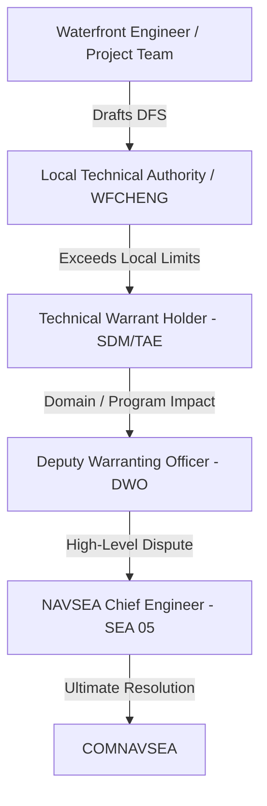

# EDO Qualification Board Study Material

This study material is designed to prepare you for the EDO Qualification Board, specifically addressing the high-yield
topics compiled in [2026-06-02-addtional-info.md](../plans/2026-06-02-addtional-info.md). It is cross-referenced with
official DoD/Navy instructions and the core study guide LaTeX chapters.

---

## 1. Maintenance (RMCs and Shipyards)

*Primary Source Basis:* [19_Fleet_Maintenance_Assets.tex](../../tex/chapters/19_Fleet_Maintenance_Assets.tex)
*and the Joint Fleet Maintenance Manual (JFMM).*

### Levels of Maintenance

Navy maintenance is categorized into three levels, matching the complexity of work to the specialization and capacity of
the workforce:

1. **Organizational (O-Level)**: Performed by Ship's Force (crew). Focuses on planned maintenance (PMS) and limited
   corrective actions (e.g., lubrication, modular change-outs, minor repairs). Purpose: Maximize self-sufficiency.
2. **Intermediate (I-Level)**: Performed by afloat tenders (e.g., submarine tenders) or shore-based intermediate
   maintenance activities (IMAs/IMFs). Involves routine calibration, gas turbine swap-outs, pump overhauls, corrosion
   control, and weight testing.
3. **Depot (D-Level)**: Major industrial work requiring specialized facilities (dry docks, heavy shops) and skilled
   civilian or private workforces. Includes underwater hull work, shaft overhauls, major modernization, and reactor
   refueling/defueling.

### Public Naval Shipyards

The Navy operates four public shipyards under **NAVSEA 04**, which are government-owned and focus primarily on
nuclear-powered aircraft carriers and submarines:

* **Portsmouth Naval Shipyard (PNSY)** (Kittery, ME): Specializes in Los Angeles- and Virginia-class SSN overhaul,
  repair, and modernization.
* **Norfolk Naval Shipyard (NNSY)** (Portsmouth, VA): Specializes in aircraft carrier (CVN) and submarine
  (SSN/SSBN/SSGN) maintenance, modernization, and inactivation.
* **Puget Sound Naval Shipyard & IMF (PSNS & IMF)** (Bremerton, WA): Specializes in CVN and submarine maintenance,
  defueling, inactivation, and reactor compartment disposal.
  *Note: PSNS is the only shipyard that recycles nuclear-powered vessels.*
* **Pearl Harbor Naval Shipyard & IMF (PHNSY & IMF)** (Pearl Harbor, HI): Specializes in submarine maintenance,
  modernization, and emergent CVN support for the Pacific Fleet.

> [!NOTE]
> **Shipyard Demographics Trap:** FY17 Q1 data highlighted a high concentration of early-career personnel (5 years or
> less experience) across the public yards: Portsmouth (40.7%), Norfolk (46.2%), Puget Sound (43.3%), and Pearl Harbor
> (35.8%). Be prepared to discuss training pipelines and supervision challenges.

### Regional Maintenance Centers (RMCs)

Overseen by the **Commander, Navy Regional Maintenance Center (CNRMC)**, the RMCs manage conventional surface ship
depot-level maintenance (via private contracts) and provide intermediate military repair and Fleet Technical Assistance
(FTA):

* **MARMC** (Mid-Atlantic RMC - Norfolk, VA)
* **SERMC** (Southeast RMC - Mayport, FL)
* **SWRMC** (Southwest RMC - San Diego, CA)
* **FDRMC** (Forward Deployed RMC - Naples, Italy; detachments in Rota, Spain and Manama, Bahrain)
* **NWRMC** (Northwest RMC - Bremerton, WA; co-located and integrated with PSNS & IMF)
* **HRMC** (Hawaii RMC - Pearl Harbor, HI; co-located and integrated with PHNSY & IMF)

### Other Key Waterfront Organizations

* **Ship Repair Facility (SRF/JRMC)** (Yokosuka & Sasebo, Japan): Non-nuclear depot/intermediate facility executing
  Seventh Fleet emergent repairs and availabilities.
* **Supervisor of Shipbuilding (SUPSHIP)**: Administers new construction, nuclear repair, and modernization contracts at
  private shipyards (e.g., Electric Boat, Newport News). Acts as the Administrative Contracting Officer (ACO).

### EDO Support Roles on the Waterfront

EDOs bridge the gap between technical standards, business management, and fleet operations:

* **Shipyards**: Serve as Shipyard Commanders (COs), Production Officers, Project Superintendents (managing availability
  cost/schedule), Quality Assurance Officers, and Chief Test Engineers.
* **RMCs**: Serve as COs, Waterfront Chief Engineers (WFCHENGs), Project Managers, and Contracting Officer's
  Representatives (CORs).
* **SUPSHIPs**: Serve as Supervisors, Deputy Supervisors, and ACOs managing Navy-builder contracts.

---

## 2. Technical Authority

*Primary Source Basis:* [2_TA_EA.tex](../../tex/chapters/2_TA_EA.tex)
*and SECNAVINST 5400.15 series / SECNAVINST 5430.7 series.*

### Definition of Technical Authority (TA)

TA is the authority, responsibility, and accountability to establish, monitor, and approve technical standards, tools,
and processes in conformance with higher authority policy. TA is an **inherently governmental function** assigned by
SECNAV to SYSCOM commanders.

* **Ultimate TA for Ships/Weapons**: Commander, NAVSEA (COMNAVSEA)
* **Ultimate TA for C4ISR/Cyber/IT**: Commander, NAVWAR (COMNAVWAR)

### Technical Warrant Holders (TWHs)

TWHs are formally warranted individuals with the authority to set and enforce technical standards. Key TWH roles
include:

* **Ship Design Manager (SDM)**: Integrates platform-level systems engineering and design.
* **Systems Integration Manager (SIM)**: Coordinates cross-system integration (e.g., combat systems).
* **Cost Engineering Manager (CEM)**: Establishes independent program cost estimates.
* **Technical Area Expert (TAE)**: Domain specialist (e.g., shock, propulsion, structures).
* **Technical Process Owner (TPO)**: Defines standard technical processes.
* **Waterfront Chief Engineer (WFCHENG)**: Leads local technical authority at RMCs, yards, and SUPSHIPs.

### Waterfront Technical Issue Resolution & DFS

When a repair or installation cannot meet official drawings, specifications, or standards, a
**Departure from Specification (DFS)** must be submitted:

1. **Waterfront Engineer / Project Team** identifies the issue and drafts the DFS.
2. **Local Technical Authority (LTA) / WFCHENG** adjudicates within delegated local limits.
3. **Technical Warrant Holder (TWH)** (e.g., SDM or TAE at NAVSEA 05) resolves the DFS if it exceeds LTA limits or
   crosses system boundaries.
4. **Deputy Warranting Officer (DWO)** reviews issues with broad domain or program-level impacts.
5. **NAVSEA Chief Engineer (CHENG, SEA 05)** resolves disputes between DWOs and sets overall policy.
6. **COMNAVSEA** acts as the final TA arbiter.



### Programmatic vs. Technical Disputes

* **Programmatic Authority** (Cost, Schedule, Performance) resides with the Program Manager (PM) and Program Executive
  Officer (PEO).
* **Technical Authority** (Safety, Standards) resides with the TWH and SYSCOM.
* **Resolution**: A PM **cannot** override a TWH's disapproval of a technical deviation. Disputes must be elevated
  through their respective chains to the PEO and COMNAVSEA level, and ultimately to **ASN(RD&A)** for final
  adjudication.
* **Get to Yes Safely**: EDOs must avoid unnecessary "no's" and analysis paralysis. Use engineering judgment to provide
  safe, realistic, risk-informed alternatives with clear operational boundaries.

> [!WARNING]
> **Why Technical Authority is Required: USS Dolphin (AGSS-555) Case Study** On 21 May 2002, USS Dolphin experienced
> catastrophic flooding and fires. An unauthorized substitution of a black D-shaped sponge gasket for the specified red
> silicone gasket (made without Technical Authority approval) allowed water to bypass the Mk 54 shield side door in
> heavy seas. This flooded the spaces, knocked out power, and nearly resulted in the loss of the submarine.

---

## 3. AIT and Installs

*Primary Source Basis:*
[22_AIT_Fundamentals_and_Lessons_Learned.tex](../../tex/chapters/22_AIT_Fundamentals_and_Lessons_Learned.tex)
*and NAVSEAINST 4720.14 series.*

### Alteration Installation Team (AIT)

An AIT is a dedicated, trained team (military, civilian, or contractor) responsible for installing specific ship changes
and alterations across multiple ships.

* **Advantages**: Specialized skills, highly repeatable quality, and rapid capture of lessons learned across a class.
* **Examples**: CANES (C4ISR), Aegis Weapon System upgrades, GP NTS.

### Key Roles and Waterfront Coordination

* **AIT Sponsor**: Funds and assigns the task (e.g., PEO, PM, TYCOM).
* **AIT Manager**: Plans installation, assigns the team, and designates the OSIC.
* **On-Site Installation Coordinator (OSIC)**: The AIT Manager's representative on-site. Directs the installation,
  coordinates with the shipyard/RMC, and handles QA.
* **Naval Shipbuilding Activity (NSA) / Lead Maintenance Activity (LMA)**: Integrates the availability. Gates AIT
  access, enforces technical specs, and monitors QA.
* **RMMCO (Regional Maintenance Modernization Coordinating Office)**: The waterfront "gatekeeper" (check-in required
  **30 days prior** to install). Verifies approved Ship Change Documents (SCDs), Ship Installation Drawings (SIDs),
  System Operational Verification Test (SOVT) plans, and certified Integrated Logistics Support (ILS) products.

### Memorandum of Agreement (MOA)

An AIT is not self-sufficient. A **MOA** must be signed by **A-1** (one day before availability start) between the LMA,
AIT Manager, Ship's Force, and NSA. It governs tag-out controls, safety, working hours, fire protocols, and support
services.

### Product Line Integration Walkthrough (12 Steps)

```text
[System Production] 
       ↓
[Factory Acceptance Testing (FAT)] 
       ↓
[Staging & Delivery] 
       ↓
[NMP & SCD Approval] (SCD approved by PM & TWH)
       ↓
[Installation Package Development] (SIDs & SOVT drafted)
       ↓
[RMMCO Gatekeeping] (Check-in 30 days prior to install)
       ↓
[Waterfront Coordination] (MOA signed at A-1)
       ↓
[Physical Installation] (AIT executes structural/cabling work)
       ↓
[System Testing] (SOVT executed by AIT & Ship's Force)
       ↓
[QA & Certification] (NSA/OSIC sign completion paperwork)
       ↓
[Logistics Handover] (Manuals, spares, APLs turned over to crew)
       ↓
[Configuration Update] (CDMD-OA updated within 30 days)
```

### Modernization Differences by Class

* **Conventional Surface Ships**: Standard Navy Modernization Process (NMP) driven by SCDs and gated on the waterfront
  by RMMCO.
* **Submarines and Nuclear Vessels**: Extremely rigid boundaries. Alterations inside
  **SUBSAFE, Fly-By-Wire, or Nuclear (NAVSEA 08)** boundaries require certified activities (e.g., public yards) and
  strict double-signature QA audits.
* **Temporary Alterations (TempAlts)**: Submarine TempAlts are strictly time-bound, tracked on active status lists, and
  must be uninstalled before the approved expiration date.
* **ISEA Involvement**: The In-Service Engineering Activity (ISEA) serves as the lifecycle engineering agent. They write
  the SIDs and SOVTs, ensure ILS product availability, and provide technical oversight.

---

## 4. Testing

*Primary Source Basis:* [18B_test-eval.tex](../../tex/chapters/18B_test-eval.tex) *and DoDI 5000.89 / DoDI 5000.98.*

### Verification vs. Validation

Testing in the Navy focuses on answering two core questions:

* **"Did we build the thing right?" $\rightarrow$ Verification (Developmental Testing / DT&E)**: Evaluates the system
  against documented technical specifications, drawings, and baseline standards.
* **"Did we build the right thing?" $\rightarrow$ Validation (Operational Testing / OT&E)**: Evaluates the system in a
  realistic operational environment, using representative operators, against warfighting capability requirements
  (KPPs/KSAs).

| Attribute       | Developmental Test & Evaluation (DT&E)                                          | Operational Test & Evaluation (OT&E)                                                    |
| --------------- | ------------------------------------------------------------------------------- | --------------------------------------------------------------------------------------- |
| **Purpose**     | Engineering feedback loop; finds design & reliability errors early.             | Readiness judgment; determines operational effectiveness & suitability.                 |
| **Led By**      | Program Manager, Chief Developmental Tester (CDT), Lead DT Organization (LDTO). | Independent Operational Test Agency (OTA) - e.g., **OPTEVFOR/COMOPTEVFOR**.             |
| **Environment** | Controlled labs, test ranges, digital threads, land-based sites.                | Realistic threat environments, representative fleet operators, operational constraints. |
| **Timing**      | Starts early (MSA/TMRR) and runs through EMD.                                   | Conducted on production-representative articles prior to FRP (IOT&E).                   |

### Statutory Roles and Requirements

* **DOT&E (10 U.S.C. 139)**: The Director, Operational Test and Evaluation is the independent statutory advisor to the
  SECDEF and Congress. DOT&E:
  * Approves operational test plans and live-fire test strategies for all covered programs.
  * Monitors operational and live-fire test execution.
  * Submits independent adequacy and operational capability assessment reports directly to Congress, SECDEF, and the MDA
    before a program can proceed beyond LRIP or enter full-rate production.
* **10 U.S.C. 4171**: Requires covered programs to complete adequate operational test and evaluation before proceeding
  beyond LRIP.
* **10 U.S.C. 4172 (LFT&E)**: Mandates Live Fire Test & Evaluation (survability/lethality testing) for covered
  crew-occupied platforms and munitions before full-rate production. Waivers require SECDEF approval and congressional
  notification.

### Navy Independent Operational Test Agency (OTA)

**OPTEVFOR** (Operational Test and Evaluation Force, still commonly tested on boards as **COMOPTEVFOR**, the commander
acronym) reports directly to the CNO to maintain independence from program offices and PEOs:

* Plans and executes independent Navy OT&E.
* Assesses operational effectiveness (can the system complete the mission?) and operational suitability (reliability,
  maintainability, training, supportability).
* Serves as the sole certification authority for the **Operational Test Readiness Review (OTRR)** to certify that a
  program is ready for OPEVAL.
* Recommends restricted Fleet release to the CNO and MDA if Category-I deficiencies remain.

---

## 5. Other Notes (PPBE, MCA, and SE Reviews)

*Primary Source Basis:* [6_PPBE.tex](../../tex/chapters/6_PPBE.tex),
[9_Program_Funding_and_Execution.tex](../../tex/chapters/9_Program_Funding_and_Execution.tex),
[16_Milestones.tex](../../tex/chapters/16_Milestones.tex), *and*
[17I_CM_and_Technical_Reviews.tex](../../tex/chapters/17I_CM_and_Technical_Reviews.tex).

### Planning, Programming, Budgeting, and Execution (PPBE)

PPBE is the calendar-driven resource allocation process that funds the DoD.

```text
[Planning] ───────────► [Programming] ───────────► [Budgeting] ───────────► [Execution]
Strategic priorities    POM development (5 years)  BES development (1 year)   Obligation & Reprogramming
(Outputs: CPR, DPG)     (Signed by SECNAV)         (Signed by FMB/N82)        (Mid-year reviews)
```

### OPNAV Resource Sponsors

* **N1**: Manpower, Personnel, Training, and Education.
* **N2/N6**: Information Warfare.
* **N3/N5**: Navy Warfare Development / Operations.
* **N4**: Afloat and Shore Readiness.
* **N8**: **Integrator** of Navy capabilities and resources (N80 builds/integrates the POM; N81 conducts assessments).
  *Note: N8 is the "checkbook" integrator, not a platform sponsor.*
* **N9**: Warfare Systems Resource-Sponsor Family:
  * **N94**: Test & Evaluation
  * **N95**: Expeditionary Warfare
  * **N96**: Surface Warfare
  * **N97**: Undersea Warfare
  * **N98**: Air Warfare
  * **N99**: Unmanned Warfare Systems
  * **N9I/9I**: Integrated Warfare (cross-portfolio integration)

### FMB / N82 (DASN Budget / Fiscal Management Division)

FMB/N82 manages the Navy budgeting and execution-control arm:

* Converts the programming POM into the **Budget Estimate Submission (BES)**.
* Defends Navy estimates through OSD and OMB hearings.
* Responds to Program Budget Decisions (PBDs) and Congressional marks via **reclamas**.
* Manages appropriation execution (RDT&E, SCN, O&MN, etc.) and obligations.

### Systems Engineering Reviews

SE reviews are event-driven maturity gates that align configuration baselines to the acquisition lifecycle:

| Review                                       | Phase   | Primary Baseline / Focus     | EDO Board-Prep Purpose                                                  |
| -------------------------------------------- | ------- | ---------------------------- | ----------------------------------------------------------------------- |
| **ASR** (Alternative System Review)          | MSA     | Preferred Material Solution  | Feasibility, affordability, and initial system concepts.                |
| **SRR** (System Requirements Review)         | TMRR    | System Requirements          | Verifies traceable and testable system requirements.                    |
| **SFR** (System Functional Review)           | TMRR    | Functional Baseline          | Verifies functional architecture satisfies requirements.                |
| **PDR** (Preliminary Design Review)          | TMRR    | **Allocated Baseline**       | Verifies preliminary design is mature enough for detailed design.       |
| **CDR** (Critical Design Review)             | EMD     | **Initial Product Baseline** | Confirms design stability; ready to start fabrication/coding.           |
| **TRR** (Test Readiness Review)              | EMD     | Test Readiness               | Verifies test assets, safety, and procedures are ready for test.        |
| **SVR / FCA** (System Verification Review)   | EMD     | Verification                 | Verifies system meets functional/allocated baseline requirements.       |
| **PRR** (Production Readiness Review)        | EMD/P&D | Production Readiness         | Assesses manufacturing plans, quality, and supply chain prior to LRIP.  |
| **OTRR** (Operational Test Readiness Review) | P&D     | Operational Readiness        | OPTEVFOR/COMOPTEVFOR certification that the system is ready for OPEVAL. |
| **PCA** (Physical Configuration Audit)       | P&D     | **Final Product Baseline**   | Audits the "as-built" production item against documentation.            |

### MCA Pathway Board Flow

The **Major Capability Acquisition (MCA) pathway** is the deliberate acquisition path for complex defense programs that
need mature requirements, disciplined milestone decisions, engineering maturity, production readiness, sustainment
planning, and formal T&E before large-scale fielding.

**Board answer flow:** validated gap or need → MDD → MSA → Milestone A → TMRR → Development RFP Release →
Milestone B → EMD → Milestone C → P&D / LRIP → IOT&E → FRP/FD → O&S.

| Event                       | Purpose                                                                                                              | Typical Board Entry/Exit Logic                                                                                                                                                                        | Major Players                                                                                                    |
| --------------------------- | -------------------------------------------------------------------------------------------------------------------- | ----------------------------------------------------------------------------------------------------------------------------------------------------------------------------------------------------- | ---------------------------------------------------------------------------------------------------------------- |
| **MDD**                     | Authorizes entry into the MCA process and normally starts **`Materiel Solution Analysis` (MSA)**.                    | Entry is a validated requirements document such as an ICD or equivalent need, plus AoA study guidance/plan. Exit is MDA authorization to analyze `materiel` solutions.                                | MDA, sponsor/resource sponsor, requirements authority, DCAPE or component cost/AoA lead, CAE/PEO/PM as assigned. |
| **MSA / AoA**               | Compares `materiel` alternatives for cost, schedule, performance, risk, and affordability.                           | Outputs include the preferred `materiel` solution, AoA results, acquisition strategy input, and risk understanding for Milestone A.                                                                   | PM/PEO, sponsor, cost estimators, T&E, engineering, sustainment, contracting, user/fleet reps.                   |
| **Milestone A**             | Authorizes **Technology Maturation and Risk Reduction (TMRR)**.                                                      | Board focus: is there a viable preferred solution, a risk-reduction plan, affordability basis, and enough funding to mature technology and requirements?                                              | MDA, CAE/PEO/PM, requirements authority, engineering/TA, T&E, comptroller, contracting, sustainment.             |
| **TMRR**                    | Reduces technical risk, matures the design enough for development, and matures the draft CDD into a validated CDD.   | Exit requires enough design/requirements maturity to release the development RFP and support Milestone B.                                                                                             | PM/PEO, industry competitors, systems engineering, T&E, requirements sponsor, TA/TWH, contracting.               |
| **Development RFP Release** | Locks enough of the government strategy to release the EMD solicitation.                                             | The validated CDD should precede this decision. The ADM should identify criteria for Milestone C, including T&E, affordability, sustainment metrics, LRIP/limited deployment scope, and FYDP funding. | MDA, PM/PEO, contracting, legal, engineering, T&E, cost, sustainment, requirements authority.                    |
| **Milestone B**             | Authorizes **Engineering and Manufacturing Development (EMD)** and usually establishes the formal Program of Record. | Board focus: validated CDD, APB, acquisition strategy, funding in the FYDP, T&E strategy/TEMP, risk posture, affordability, and executable EMD contract strategy.                                     | MDA, CAE/PEO/PM, resource sponsor, comptroller, contracting, T&E, engineering/TA, sustainment, user/fleet reps.  |
| **EMD**                     | Completes detailed design, builds/test articles, verifies design, and prepares for production.                       | Exit logic is production-representative maturity, completed/adequate DT, readiness for OT, stable product baseline, and producibility/sustainment readiness.                                          | PM/PEO, contractor, LSE, CDT, OTA, TWH/TA, ISEA, production/logistics teams.                                     |
| **Milestone C**             | Authorizes Production and Deployment, usually LRIP or limited deployment first.                                      | Board focus: production readiness, test results, supportability, manufacturing maturity, risk, affordability, and the plan to get to IOT&E/FRP.                                                       | MDA, PM/PEO, production/logistics, T&E, comptroller, contracting, fleet/user reps.                               |
| **FRP/FD Decision**         | Approves full-rate production or full deployment after adequate operational test evidence.                           | DOT&E provides its independent report for MDAPs and DOT&E oversight programs before proceeding beyond LRIP.                                                                                           | MDA, DOT&E, OTA/OPTEVFOR, PM/PEO, fleet/user reps, sustainment and production stakeholders.                      |

### Command Relationships: ADCON, OPCON, and Acquisition

**ADCON** is the administrative/service chain: organize, train, equip, man, maintain, discipline, sustain, and resource
forces. In acquisition language, ADCON is where the Navy's Title 10 "equip and sustain" responsibility lives through
SECNAV/CNO, ASN(RD&A), SYSCOMs, PEOs, warfare centers, shipyards, RMCs, and program offices.

**OPCON** is the operational-employment chain: commanders use assigned or allocated forces to accomplish missions. In
acquisition language, OPCON fleet commanders are not normally the PM's acquisition chain, but they are the operational
customer whose mission needs, CASREPs, TYCOM priorities, fleet feedback, test participation, and availability
constraints shape requirements, modernization priorities, and fielding decisions.

**Board line:** acquisition is resourced and executed through the ADCON/provider side, but it must deliver capability
that the OPCON/fleet side can actually employ, maintain, train to, and fight with.

### Flow of a Dollar

PPBE is the planning and resource-allocation process; execution is where the money becomes legally available, obligated,
expended, and finally outlayed. A board answer should separate **who asks for money**,
**who provides budget authority**, and **who legally obligates it**.

1. **Need is identified** by the fleet, sponsor, program office, or sustainment enterprise.
2. **Planning and programming** translate that need into program content through sponsor/N8/FMB/PEO/PM coordination and
   the POM/BES cycle.
3. **Congress authorizes and appropriates** budget authority by purpose, time, and amount.
4. **OMB apportions** appropriated funds; DoD Comptroller distributes funds to Military Departments and defense
   agencies.
5. **DON/FMB and Navy comptroller channels allot/sub-allot** funds to SYSCOMs, PEOs, PMs, yards, or other execution
   activities.
6. **PM/contracting/field activity commits** funds internally for a planned action.
7. **Contracting or ordering authority obligates** funds by contract, order, MIPR, project order, or work authorization.
8. **Vendor or performing activity delivers** goods/services and invoices.
9. **Government accepts and expends** funds when payment is made against the obligation.
10. **Treasury outlays** cash from the government.

**Statutory guardrails:** 31 U.S.C. 1301 is the purpose rule; 31 U.S.C. 1502 is the time/bona-fide-need rule; 31 U.S.C.
1341 is the amount/Anti-Deficiency rule. For a board answer, say: "right color, right year, right amount."

---

## 6. Warfare Centers, Supply, and Fleet Fielding

*Primary Source Basis:* [3_NAVSEA.tex](../../tex/chapters/3_NAVSEA.tex),
[17J_Acquisition_Logistics.tex](../../tex/chapters/17J_Acquisition_Logistics.tex),
[20_Navy_Modernization_Program.tex](../../tex/chapters/20_Navy_Modernization_Program.tex),
[22_AIT_Fundamentals_and_Lessons_Learned.tex](../../tex/chapters/22_AIT_Fundamentals_and_Lessons_Learned.tex),
[26_CNO_Availability_Execution.tex](../../tex/chapters/26_CNO_Availability_Execution.tex), NAVSEA Warfare Centers
official pages, NAVSUP WSS official pages, and NAVSEA Standard Items.*

### NAVSEA Warfare Centers Quick Map

The warfare centers are NAVSEA's technical depth: RDT&E, engineering, test, assessment, in-service engineering,
depot/industrial support, logistics, and fleet technical support. Their primary customers are NAVSEA, PEOs, program
offices, fleet/TYCOMs, shipyards/RMCs, joint customers, and allied partners depending on the product line.

| Warfare Center          | Main Location                                  | Product / Board Cue                                                                                                                       | Major Customers                                                                            |
| ----------------------- | ---------------------------------------------- | ----------------------------------------------------------------------------------------------------------------------------------------- | ------------------------------------------------------------------------------------------ |
| **`NSWC Carderock`**    | West Bethesda, MD, with detachments            | Ship design, naval architecture, hydrodynamics, signatures, structures, combatant craft, platform engineering.                            | NAVSEA, Team Ships, Team Subs, shipyards, fleet.                                           |
| **`NSWC Corona`**       | Corona, CA                                     | Independent assessment, analytics, data-driven performance assessment, readiness measurement, metrology/calibration.                      | Fleet, NAVSEA, PEOs, warfare commanders.                                                   |
| **`NSWC Crane`**        | Crane, IN                                      | Electromagnetic warfare, expeditionary warfare systems, strategic systems components, sensors/electronics sustainment.                    | NAVSEA, NAVWAR/NAVAIR partners, strategic systems, special operations and fleet customers. |
| **`NSWC Dahlgren`**     | Dahlgren, VA, with Dam Neck Activity           | Surface ship weapons-system development and integration, combat-system integration, missile defense, directed energy and weapons control. | PEO IWS, surface fleet, joint and homeland defense customers.                              |
| **`NSWC Indian Head`**  | Indian Head, MD                                | Energetics, ordnance, explosives, propellants, EOD technologies, energetics manufacturing/industrial base.                                | Navy, joint ordnance/EOD, PEOs, fleet.                                                     |
| **`NSWC Panama City`**  | Panama City, FL                                | Mine warfare, littoral warfare systems, amphibious/expeditionary systems, diving and life-support systems.                                | Expeditionary, mine warfare, special warfare, fleet and PEO customers.                     |
| **`NSWC Philadelphia`** | Philadelphia, PA                               | Surface and undersea machinery, power, controls, auxiliary ship systems, machinery cybersecurity/control systems.                         | NAVSEA, shipyards/RMCs, Team Ships, Team Subs, fleet.                                      |
| **`NSWC Port Hueneme`** | Port Hueneme, CA                               | Surface-warfare combat-system in-service engineering, integration, T&E, logistics, product support.                                       | PEO IWS, surface fleet, Aegis/combat-system program offices.                               |
| **`NUWC Keyport`**      | Keyport, WA, with Pacific detachments and NSLC | Undersea warfare sustainment, undersea ranges, test/evaluation, fielding and maintenance for undersea systems and vehicles.               | Team Subs, PEO UWS, submarine force, allied undersea customers.                            |
| **`NUWC Newport`**      | Newport, RI                                    | Full-spectrum undersea RDT&E, engineering, T&E, fleet support for submarine and undersea battlespace systems.                             | Team Subs, PEO UWS, submarine force, undersea warfare customers.                           |

### Navy Supply Repair-Parts Walkthrough

When a ship or submarine needs repair parts, the flow is operational need → requisition → inventory/source decision →
contracting/repair action if required → delivery → configuration/logistics update.

**Board answer flow:**

1. Ship's Force, yard, RMC, or ISEA identifies the material need using the technical manual, APL/AEL/COSAL, allowance,
   maintenance requirement, CASREP, or availability work package.
2. Supply submits the requisition through Navy supply systems; priority depends on mission impact, CASREP status,
   availability schedule, and required delivery date.
3. **NAVSUP WSS** provides weapon-system supply support and centrally manages hundreds of thousands of
   repair-part/component line items for ships, submarines, aircraft, and weapon systems.
4. If material is available, it moves through the Navy/DoD logistics network to the ship, tender, yard, RMC, or
   contractor.
5. If material is not available, supply and engineering coordinate alternatives: lateral redistribution, repairables,
   cannibalization authority when approved, local procurement, DLA/common-item sourcing, vendor buy, organic repair, or
   engineering disposition for obsolete/DMSMS parts.
6. The PM/ISEA/logistics team closes the loop by updating ILS products, configuration records, technical manuals,
   allowance data, and sparing strategy so the next ship does not repeat the same failure path.

**EDO board cue:** supply is not just "ordering parts." It is a readiness system tied to configuration, technical data,
contracts, organic repair, DMSMS, and schedule risk in availabilities.

### Program Office to Ship/Sub Installation

How EDO acquisition supports the fleet from program office to installation:

1. Fleet or sponsor identifies a capability gap or readiness problem.
2. Program office obtains requirements, funding, acquisition strategy, and engineering authority alignment.
3. System is designed, contracted, developed, and tested with ISEA, TWH/TA, logistics, cybersecurity, training, and
   fleet input.
4. The approved configuration change is documented through the Navy Modernization Process and a
   **Ship Change Document (SCD)**, SHIPALT, ORDALT, EC, FC, MACHALT, AER, or equivalent authorization.
5. ISEA develops or reviews SIDs, SOVT, technical manuals, ILS products, training, and troubleshooting support.
6. RMMCO and the LMA integrate the installation into the ship's availability, deconflict work, and enforce readiness
   gates.
7. AIT, shipyard, RMC, or another authorized installing activity performs the alteration under QA, safety, tag-out, DFS,
   and configuration-control rules.
8. SOVT/verification confirms the shipboard installation works in the installed environment.
9. Configuration, logistics, training, maintenance, and technical-data products are turned over to Ship's Force and
   recorded.
10. Fleet feedback, CASREPs, OT results, deficiency reports, and sustainment data feed back to the PM, ISEA, and TA.

### Ship Change Process and ISEA Role

The ship change process exists to prevent "good ideas" from becoming uncontrolled ship configuration changes. The key
question is: who owns the technical baseline, who pays, who installs, who verifies, and who updates the ship record?

* **SCD / SHIPALT / ORDALT / EC / FC / MACHALT / AER**: Authorization vehicles for configuration change depending on
  system type, scope, and governing process.
* **TWH / TA**: Ensures the change is technically acceptable and does not break safety, survivability, combat-system
  integration, cybersecurity, SUBSAFE, nuclear, or platform boundaries.
* **PM / PEO**: Owns cost, schedule, performance, contracts, and fielding strategy.
* **ISEA**: Provides lifecycle engineering; develops or reviews SIDs, SOVT, drawings, technical manuals, troubleshooting
  procedures, sparing, training, and configuration updates.
* **RMMCO / LMA / NSA / RMC / Shipyard**: Controls waterfront execution, availability integration, work sequencing,
  tag-outs, QA, safety, and closeout.
* **Ship's Force / TYCOM / Fleet**: Provides operational priority, access, tag-out coordination, test participation,
  training acceptance, and post-install feedback.

**Disagreement rule:** if stakeholders disagree with the technical authority, do not solve it by local preference or
schedule pressure. Elevate through LTA/WFCHENG → TWH → DWO → SEA 05/Chief Engineer → COMNAVSEA as needed, while the
PM/PEO/fleet side manages cost, schedule, operational impact, and risk acceptance within its own authority.

---

## 7. Prior Murder Board Addendum

*Primary Source Basis:* MurderBoardNotes.pdf local board-note input,
[11_Contracting_Fundamentals.tex](../../tex/chapters/11_Contracting_Fundamentals.tex),
[12_Solicitation.tex](../../tex/chapters/12_Solicitation.tex),
[12A_Source_Selection.tex](../../tex/chapters/12A_Source_Selection.tex),
[13A_Source_Selection_Practical.tex](../../tex/chapters/13A_Source_Selection_Practical.tex),
[14_EVM.tex](../../tex/chapters/14_EVM.tex),
[10_Cost_Fundamentals.tex](../../tex/chapters/10_Cost_Fundamentals.tex),
[7_NWCF.tex](../../tex/chapters/7_NWCF.tex),
[8_Congressional_Enactment.tex](../../tex/chapters/8_Congressional_Enactment.tex),
[27_CIVPERS.tex](../../tex/chapters/27_CIVPERS.tex),
[4_NAVWAR.tex](../../tex/chapters/4_NAVWAR.tex),
[appendix_key_roles.tex](../../tex/chapters/appendix_key_roles.tex), and current official sources listed below.*

### Contract Types, REAs, and Fee Boards

The board usually wants you to connect **risk**, **scope maturity**, **incentives**, and **Government oversight burden**.

| Contract type | Use when | Strength | Weakness / Board Trap |
| --- | --- | --- | --- |
| **FFP** | Requirement is stable, specifications are clear, price can be established fair and reasonable at award. | Contractor has maximum cost risk; Government has low administrative burden. | Bad fit for immature scope. Contractor may price risk high, reduce margin, push quality/schedule, or seek changes/REA if Government-caused scope changes occur. |
| **FPIF / FPI** | Work is more mature than cost-type work, but cost risk remains measurable and a target-cost/share-line incentive is useful. | Contractor shares cost risk; profit changes by objective formula. | Requires adequate cost data and negotiated targets. The math must be explainable. |
| **CPFF** | Scope is uncertain but effort is necessary; contractor should not bear full cost risk. | Allows flexible performance when costs cannot be estimated accurately. | Fee is fixed, so it is weak as a cost-control incentive. Government cost surveillance burden is higher. |
| **CPFF LOE** | The deliverable is a specified level of effort for a stated period, not a completed product. | Good for studies, support, advisory, or exploratory work. | Contractor delivers hours/effort; the Government must manage whether the effort is producing useful outcomes. |
| **CPIF** | Costs are uncertain, but objective cost/schedule/performance targets can be measured. | Incentive fee moves by formula, giving clearer cost discipline than CPFF. | Requires well-designed targets, share ratios, and surveillance. |
| **CPAF / Award Fee** | Desired behavior cannot be measured well by an objective formula. | Gives the Government judgment-based flexibility to reward excellent cost, schedule, technical, or management performance. | High Government burden: written award-fee plan, surveillance, award-fee board, fee-determining official, and documented evaluation. Do not use award fee when objective incentives would work. |
| **T&M / Labor Hour** | Labor categories and rates are known but exact work volume is uncertain. | Useful for limited, urgent, or support work when other types are impractical. | Highest oversight risk; Government must surveil hours and avoid letting T&M become unmanaged staff augmentation. |
| **IDIQ / Task Order** | Need recurring work or supplies but exact quantities/timing are unknown. | Flexible ordering vehicle with negotiated ceiling and task-level control. | Each order still needs proper scope, funding, and surveillance. |

**Request for Equitable Adjustment (REA):** an REA is not the contractor saying, "I dislike my FFP deal." It is the contractor asserting that a Government action, constructive change, differing condition, or other contract-recognized event changed cost, schedule, or terms and the contract should be equitably adjusted. For DoD contracts above the simplified acquisition threshold, DFARS requires a certified REA. If the parties cannot resolve it, the matter can move toward a Contract Disputes Act claim.

**FFP board trap:** on FFP, the contractor normally absorbs ordinary cost growth because the price is not adjusted based on cost experience. The contractor can still seek relief for Government-caused changes, defective specifications, differing site conditions, delay/disruption, or other clauses that permit adjustment.

**Award-fee board answer:** the award-fee plan sets evaluation periods, criteria, board membership, and the fee-determining official. The contractor earns fee based on the Government's judgment against the plan. From the Government view, award fee motivates hard-to-measure excellence. From the contractor view, it is potential fee at risk and a signal of customer satisfaction. A $0 award fee means the Government determined performance did not earn fee for that period; do not promise a merit re-score as normal recourse. The contractor may challenge whether the Government followed the contract or abused discretion, but the point of award fee is unilateral Government judgment under the award-fee plan.

**Incentive fee vs award fee burden:** incentive fee requires more front-end work to define objective targets and formulas. Award fee requires more continuing Government surveillance, narrative evaluation, board discipline, and fee-determining official judgment.

### Proposals, Source Selection, and Who Can Direct Work

**Uniform Contract Format board cue:**

| UCF Part | Sections | Board Use |
| --- | --- | --- |
| **Part I - The Schedule** | A-H | Solicitation/contract form, pricing, work statement, packaging, inspection, delivery, admin data, special requirements. |
| **Part II - Contract Clauses** | I | FAR/DFARS/NMCARS clauses and local clauses. |
| **Part III - Documents/Exhibits/Attachments** | J | Attachments, CDRLs, SOW/PWS details, drawings, data, exhibits. |
| **Part IV - Representations and Instructions** | K-M | K reps/certs, **L instructions**, **M evaluation factors for award**. |

**Section M trap:** Section M is where the Government tells offerors how proposals will be evaluated. Section L tells offerors how to write/submit the proposal. Do not mix them.

**Source-selection organization:** the **SSA** owns the final best-value decision. The **SSEB** evaluates proposals against the RFP and documents strengths, weaknesses, significant weaknesses, deficiencies, risks, and ratings. The **SSAC** compares evaluation results and advises the SSA when used. Panels may include technical, cost/price, past performance, small business, and other specialty teams.

**Who can direct the contractor?** Only a warranted **Contracting Officer (KO)** can bind the Government, change the contract, or direct contract performance in a way that changes cost, schedule, scope, or terms. The PM owns program cost/schedule/performance and provides technical/programmatic direction through the KO. A COR, PM, engineer, or ship's force representative can create an unauthorized commitment if they direct out-of-scope work without KO authority.

**Industry engagement:** market research is continuous. Use RFIs, industry days, draft RFPs, one-on-ones, technical exchanges, and CSOs/OTs when appropriate, but control exchanges through the KO/source-selection rules so all offerors are treated fairly.

### Acquisition, Requirements, and T&E Board Traps

* **Milestone A:** asks the MDA to authorize entry into TMRR. Board answer: MSA/AoA has identified a preferred materiel solution; the program is ready to reduce technology and integration risk, mature requirements, and plan for EMD.
* **Milestone C:** asks the MDA to authorize production and deployment, usually LRIP or limited deployment first. Entry logic is design/test/manufacturing/support evidence. Exit logic is successful production/deployment evidence leading toward IOT&E, FRP/FD, and fielding.
* **LRIP:** produces enough production-representative articles to support operational test, manufacturing learning, training, logistics verification, and production ramp-up decisions. LRIP is not "full production."
* **FRP/FD package:** bring the body of program evidence, but the newest board-critical evidence is usually OT&E/IOT&E results, DOT&E reporting if applicable, production readiness, affordability, sustainment, and open deficiency/risk posture.
* **Testing does not start after Milestone C.** DT starts early and informs design; integrated DT/OT can occur before Milestone C; IOT&E is normally before FRP/FD on production-representative articles.
* **MTA / rapid acquisition:** DoDI 5000.80 middle-tier acquisition is for rapid prototyping or rapid fielding when maturity allows a prototype, residual operational capability, or fielding within 5 years. It moves fast, but it is not exempt from statutory requirements unless an authorized waiver applies.
* **KPP vs KSA:** KPPs are critical performance parameters; failure may put mission value at risk. KSAs are essential attributes that support a balanced solution but are not elevated to KPP criticality. Threshold is the minimum acceptable value; objective is the desired value.
* **Who creates KPPs/KSAs and ICDs:** the requirements sponsor/user community develops requirements documents; the validation authority validates them. The PM informs trade space but does not unilaterally create or waive warfighting requirements.
* **KPP/KSA waiver or relief:** go back through the requirements validation authority. If JROC validated the requirement, use the JROC/JROC-delegated process; if Component-validated, use the Component validation process. Explain why the threshold is not achievable or no longer valid, the operational impact, mitigation, and cost/schedule/performance trade.
* **OT answers two main questions:** operational effectiveness and operational suitability. For covered systems, survivability/lethality also matter through LFT&E. DOT&E provides independent oversight/reporting for covered programs and reports directly to senior DoD leadership and Congress.

### EVM, Cost Estimates, and Market Research

**EVM answer:** EVM is a contract/program management system that integrates scope, schedule, and cost to show whether work is being accomplished on plan. The **PMB** is the contractor EVM baseline; the **APB** is the MDA-approved Government program baseline for cost, schedule, and performance.

**When EVM applies:** DoD EVM policy applies to cost or incentive contracts and subcontracts at policy thresholds when the work is discretely measurable. Current DFARS policy applies ANSI/EIA-748 compliance at $20M or more for cost/incentive contracts and discourages EVM on FFP contracts unless a waiver/business case supports it. Formal EVMS validation is required at higher thresholds and DCMA is the cognizant Federal agency for EVMS compliance when DoD is the cognizant agency. The IBR is normally due within 180 days after contract award, significant option exercise, or major modification.

**Cost-estimate types:**

* **Analogy:** compares to a similar completed system.
* **Parametric:** uses cost-estimating relationships and statistical models.
* **Engineering build-up:** sums detailed estimates for components/work packages.
* **Actuals/extrapolation:** projects from actual program cost history.

**Cost-estimate products:** a life-cycle cost estimate covers the full program; an independent cost estimate is produced by an independent cost organization for major decisions; component/program estimates and CARD-quality technical baselines support affordability and milestone decisions.

**Will cost vs should cost:** will cost is the funded-to expectation absent additional management initiatives. Should cost is the lower target after specific, credible cost-reduction initiatives. A board answer should identify the engineering or business action, not just claim savings.

### PPBE, CRs, NWCF, and Stabilized Labor Rates

**PPBE program-money flow:** PM/PMW need -> PEO prioritization -> resource sponsor -> N8 integration -> SECNAV/DON POM -> OSD review, including CAPE programmatic review and Comptroller budget review -> OMB/Congress -> appropriation -> apportionment/allotment -> obligation/expenditure/outlay.

**NSS in PPBE:** the National Security Strategy is a White House strategy document that informs defense strategy and planning. It is not a Navy budget document, but it is upstream strategic context for PPBE.

**FYDP:** the Future Years Defense Program is DoD's internal database/record of forces, manpower, and funding over the budget year and out-years. DON systems such as PBIS support Navy POM/BES development and tracking.

**Continuing Resolution (CR):** a CR temporarily funds government operations when regular appropriations are not enacted. Board answer: it preserves status quo operations at constrained rates and normally restricts new starts, production-rate increases, and major program changes unless Congress provides an anomaly or specific authority. If you need to start a new program during a CR, you elevate through the chain for an anomaly/exception; do not just obligate as if full-year appropriations exist.

**If the PM needs more money:** first know whether the problem is execution-year cash, future-year programming, or a congressional mark. In execution, the PM works through PEO, comptroller/BFM, resource sponsor, and ASN(RD&A)/FMB channels for realignment, reprogramming, transfer, or supplemental action as appropriate. If contesting a budget mark, the response is a **reclama**. If the program is overrunning, the PM updates cost-to-complete/EAC, reports through program governance, and explains drivers, mitigation, and funding need.

**Underrun trap:** an underrun is not automatically good. It may show efficiency, but it may also signal schedule slip, over-budgeting, delayed contract award, or executable-work problems. Unobligated funds become vulnerable to repurposing and may weaken future-year credibility.

**NWCF vs mission funding:** mission-funded activities receive appropriations for their mission. NWCF activities operate like reimbursable business activities: customers place funded orders, the NWCF activity performs work or issues material, bills the customer, and uses revenue to replenish working capital. Work still must be paid for; quality-caused rework may affect the activity operating result/rates, while customer-directed scope growth requires customer funding.

**Stabilized labor rates (SLR):** working capital fund rates are set during the budget process to recover estimated operating costs, approved surcharges/capital requirements, and prior-year gains/losses so the activity trends toward break-even accumulated operating result. Board shorthand:

```text
SLR ~= (direct labor cost + indirect/overhead + G&A + AOR recovery + approved surcharges) / direct labor hours
```

If warfare centers raise rates too much, customers may buy fewer hours, defer work, move work to other providers, or create pressure in customer appropriations. The NWCF activity still needs rates high enough to recover full cost and remain solvent.

### Maintenance, Shipyards, NAVWAR, NIWC, and Engineering Agents

**RMC functions beyond I-level:** RMCs provide CNO availability execution support, contract management support for surface ship depot work, Fleet Technical Assistance, assessments, calibration, underwater ship husbandry/diver support, limited D-level repair coordination, and ISEA/technical reach-back coordination.

**If the RMC cannot repair it:** the next answer depends on the platform and scope. Escalate to the LMA/CNRMC/TYCOM availability chain, depot/private yard/public yard as appropriate, and the ISEA/TWH/TA chain for technical disposition. If it is a shipyard-controlled nuclear or SUBSAFE boundary, do not treat RMC escalation like ordinary I-level work.

**Private shipyard board map cues:** Bath Iron Works builds/modernizes DDG-class surface combatants; Huntington Ingalls Ingalls on the Gulf Coast builds amphibious ships and surface combatants; Newport News Shipbuilding builds/refuels/overhauls CVNs and participates in submarine construction; General Dynamics Electric Boat builds submarines; Fincantieri Marinette Marine builds frigate/LCS-type surface combatants; NASSCO builds auxiliaries/logistics ships. SUPSHIPs are the Navy's on-site contract administration, quality, engineering, and business-management presence at private yards.

**Maintenance colors of money:** routine sustainment and repair in O&S normally uses O&MN. Ship procurement/new construction uses SCN. Modernization and major end-item procurement usually uses procurement appropriations. RDT&E is used when the change requires development, test, or changes to the performance envelope. The board trap is to match the work to purpose, time, and amount, not to say "maintenance" always means O&M.

**NAVWAR/NIWC in shipyards:** NAVWAR and NIWCs support C4I, networks, communications, cyber, enterprise IT, and information-warfare systems in shipboard and shore environments. For shipyard work, they may provide SMEs, ISEA support, installation/modernization planning, T&E reach-back, troubleshooting, C4I integration, and Fleet Readiness Directorate coordination. NAVWAR 5.0 is the engineering/CHENG lane; NAVWAR 4.0 is logistics/fleet support. For CANES, NIWC/NAVWAR support installation, integration, T&E/troubleshooting, and reach-back with PMW 160.

**Engineering agents:** know these five labels and what problem they solve:

| Agent | Board cue |
| --- | --- |
| **TDA - Technical Direction Agent** | Provides technical direction and subject-matter control for a system or area. |
| **DA - Design Agent** | Owns design products and design changes. |
| **SIA - System Integration Agent** | Integrates systems across interfaces, platforms, or mission threads. |
| **AEA - Acquisition Engineering Agent** | Supports acquisition engineering, specification, test, and technical-data work. |
| **ISEA - In-Service Engineering Agent** | Supports fielded systems through lifecycle engineering, configuration, fleet technical assistance, troubleshooting, and deficiency correction. |

### NAVWAR, PAEs, DRPM Overmatch, and Current Leadership Traps

**PEO reporting:** traditional Navy PEOs report to ASN(RD&A) through acquisition governance. Current PAEs add broader portfolio accountability and direct authority over program offices plus associated technical, contracting, sustainment, and industrial-base functions. This does **not** erase the need to know legacy PEO/SYSCOM lanes for board recall, because public pages and technical authority chains are still transitioning.

**NAVWAR PEO locations and lanes:** PEO C4I is headquartered in San Diego and manages C4I program offices such as PMW 120/130/150/160/170/740/750/760/770/790. PEO Digital is the DON enterprise IT acquisition agent. PEO MLB is the manpower, logistics, and business-systems IT acquisition agent. Always verify live office locations and portfolio names before quoting them because the PAE transition is changing public-facing organization language.

**ASN(RD&A) currency trap:** older board notes that say Nickolas Guertin is current are stale. As of the official Navy release dated **May 26, 2026**, **William F. Mahan** is performing the duties of ASN(RD&A) and serves as the senior acquisition executive for the Navy and Marine Corps. Jason Potter returned to Principal Civilian Deputy ASN(RD&A). VADM Seiko Okano remains the Principal Military Deputy.

**PMD/PCD trap:** in the ASN(RD&A) org chart, **PMD** means Principal Military Deputy and **PCD** means Principal Civilian Deputy. Do not confuse this PCD with maintenance **Production Completion Date**.

**PAE:** Portfolio Acquisition Executive. Current DON public releases describe PAEs as broader portfolio authorities intended to improve speed, accountability, and cross-program integration. As of the May 11, 2026 DON release, there are **nine publicly announced PAEs**:

| PAE | Board cue |
| --- | --- |
| **Aviation** | Naval aviation portfolio; public deputy lanes are Carrier Strike, Marine Corps Aviation, and Maritime ISR/NC3. |
| **Industrial Operations** | Foundry/industrial execution: shipyards, RMCs, maintenance contracting, and industrial-base throughput. |
| **Marine Corps** | Marine Corps ground systems; replaces PEO Land Systems and incorporates MCSC acquisition support functions. |
| **Maritime** | Conventional surface-ship delivery: aircraft carriers, combatants, expeditionary/mine warfare, auxiliaries, modernization, and sustainment. |
| **Mission Systems** | Central mission integrator: PEO C4I, PEO Digital, PEO IWS, PEO MLB, DRPM Overmatch, DRPM LRNFO, DRPM MILE, Minotaur, and mission-system elements across NAVWAR, NAVSEA, NAVAIR, and MCSC. |
| **Munitions** | Weapons industrial base, air weapons, surface weapons, advanced capabilities, and innovation; includes former PEO UAS weapons offices and IWS weapons offices. |
| **Robotics and Autonomous Systems (RAS)** | Unmanned/autonomy hedge capability; current public example is MUSV marketplace at-sea demonstrations. |
| **Strategic Systems Programs (SSP)** | Sea-based strategic deterrence and strategic weapons lifecycle execution. |
| **Undersea / DRPM Submarines** | SSN, SSBN, SSGN, and undersea industrial-base execution; tied to the one Columbia/two Virginia production-rate challenge. |

**Chart answer:** draw SECNAV over ASN(RD&A), with Principal Civilian Deputy and PMILDEP under ASN(RD&A), then the PAEs as the current acquisition portfolio owners. Put CNO/CMC in the Service chain for requirements/readiness context and draw SYSCOMs/warfare centers/shipyards as the technical, contracting, sustainment, and workforce infrastructure being realigned into or in support of PAEs.

**DRPM:** Direct Reporting Program Manager. Project Overmatch is the board example: a direct-reporting program manager construct used to drive cross-PEO/SYSCOM integration for naval contribution to JADC2/CJADC2 and Distributed Maritime Operations. Board answer: DRPMs are used when the integration problem cuts across ordinary PEO/SYSCOM boundaries and needs direct senior acquisition visibility.

**Current events to drive instead of being driven:** have two or three prepared threads: warfighting acquisition reform/PAEs, continuing-resolution risk and industrial-base execution, shipbuilding/shipyard capacity, Project Overmatch and coalition interoperability, and CNO accountability/Foundry-Fleet-Fight themes.

### Civilian Personnel and Leadership

**Who to call:** start with your supervisor/chain and **HRO/Employee Relations** for performance or conduct issues. Add labor relations if the employee is bargaining-unit, OGC/counsel for adverse actions or legally sensitive matters, EEO for discrimination/reprisal allegations, IG for fraud/waste/abuse or command-integrity issues, security for clearance/security issues, and SAPR/harassment channels when applicable.

**Unions:** not every civilian is a bargaining-unit employee. A union represents bargaining-unit employees and has a duty of fair representation. Employees may join or refrain from joining. Bargaining-unit employees may have Weingarten rights during investigatory examinations when they reasonably fear discipline and request representation.

**Douglas Factors:** there are **12** nonexclusive penalty factors used for misconduct/adverse-action penalty selection. Board cue: offense seriousness, job level, past record, work record, effect on confidence/mission, consistency with similar cases and table of penalties, notoriety, notice, rehabilitation potential, mitigation, and adequacy of alternative sanctions.

**Complaint paths:** know the difference between a negotiated grievance, EEO complaint, MSPB appeal, OSC/whistleblower path, and IG complaint. Do not collapse them into one "civilian complaint board." The path depends on the issue, bargaining-unit status, action type, discrimination/reprisal claim, and appeal rights.

**Troublesome civilian personnel:** do not freelance discipline. Clarify whether the issue is performance, conduct, leave/attendance, security, EEO, or workplace conflict. Document facts, set clear expectations, consult HRO/ER and counsel, honor union/EEO rights, and use progressive discipline or performance processes when appropriate. Criticize in private, keep standards consistent, and separate human dignity from accountability.

### Board Execution Lessons

* Answer the direct question first, then transition to the prepared framework.
* Avoid "how we do it here" as the whole answer; use your tour as an example after explaining how the Navy does it.
* Know the board members' organizations, reporting chains, mission, interfaces, and likely pain points.
* Write large and organized if using a board: simple axes, clear acronyms, and no cramped tables.
* Pause before answering complex questions. It is better to say "I need to separate funding, contracting, and technical authority" than to fill silence with a wrong answer.
* Admit uncertainty cleanly, then explain where you would verify the answer.

---

## 8. Current Official Source Check (June 2026)

Use these for refresh before board use:

* [DoDI 5000.85, Major Capability Acquisition](https://www.esd.whs.mil/Portals/54/Documents/DD/issuances/dodi/500085p.PDF)
* [DoDI 5000.88, Engineering of Defense Systems](https://www.esd.whs.mil/Portals/54/Documents/DD/issuances/dodi/500088p.PDF)
* [DoDI 5000.98, Operational Test and Evaluation and Live Fire Test and Evaluation](https://www.esd.whs.mil/Portals/54/Documents/DD/issuances/dodi/500098p.PDF)
* [DoDD 7045.14, PPBE Process](https://www.esd.whs.mil/Portals/54/Documents/DD/issuances/dodd/704514p.pdf)
* [DoD FMR Volume 3, Budget Execution](https://comptroller.defense.gov/FMR/FMRVolumes/)
* [31 U.S.C. 1301](https://uscode.house.gov/view.xhtml?edition=prelim&num=0&req=granuleid%3AUSC-prelim-title31-section1301),
  [31 U.S.C. 1502](https://uscode.house.gov/view.xhtml?edition=prelim&num=0&req=granuleid%3AUSC-prelim-title31-section1502),
  and
  [31 U.S.C. 1341](https://uscode.house.gov/view.xhtml?edition=prelim&num=0&req=granuleid%3AUSC-prelim-title31-section1341)
* [NAVSEA Warfare Centers](https://www.navsea.navy.mil/Home/Warfare-Centers) and
  [NAVSEA Field Activities](https://www.navsea.navy.mil/About/Organization/Field-Activities/)
* [NAVSUP WSS](https://www.navsup.navy.mil/NAVSUP-Enterprise/NAVSUP-Weapon-Systems-Support/About-NAVSUP-WSS/) and
  [NAVSUP Mission](https://www.navsup.navy.mil/NAVSUP-Enterprise/Our-Mission/)
* [DOT&E About](https://www.dote.osd.mil/About/About-DOT-E/) and
  [OPNAVINST 5450.332C](https://www.secnav.navy.mil/doni/Directives/05000%20General%20Management%20Security%20and%20Safety%20Services/05-400%20Organization%20and%20Functional%20Support%20Services/5450.332C.pdf)
* [FAR Part 16, Types of Contracts](https://www.acquisition.gov/far/part-16),
  [FAR 15.204, Uniform Contract Format](https://www.acquisition.gov/far/15.204),
  [FAR Subpart 15.3, Source Selection](https://www.acquisition.gov/sites/default/files/current/far/compiled_html/subpart_15.3.html),
  and [DFARS 252.243-7002, Requests for Equitable Adjustment](https://www.acquisition.gov/dfars/252.243-7002-requests-equitable-adjustment.)
* [DFARS Subpart 234.2, Earned Value Management System](https://www.acq.osd.mil/dpap/dars/dfars/html/current/234_2.htm)
  and
  [DoD EVM FAQ](https://www.acq.osd.mil/asda/dpc/api/ipm/faqs.html)
* [DoDI 5000.80, Middle Tier of Acquisition](https://www.esd.whs.mil/Portals/54/Documents/DD/issuances/dodi/500080p.PDF?ver=QsDA5aJ20jnMMxhx1z5mJQ%3d%3d)
  and [DAU AAF Middle Tier of Acquisition](https://aaf.dau.edu/aaf/mta/)
* [DoD FMR Volume 11B, Working Capital Funds](https://comptroller.defense.gov/FMR/vol11b_chapters/),
  [DoD FMR Volume 11B Chapter 13, Depot Maintenance Cost Accounting](https://comptroller.defense.gov/Portals/45/documents/fmr/current/11b/11b_13.pdf),
  and
  [DoD FMR Volume 11B PDF](https://comptroller.defense.gov/Portals/45/documents/fmr/Volume_11b.pdf)
* [GAO, Effects of Continuing Resolutions on Selected DoD Activities](https://www.gao.gov/products/gao-26-107065)
  and [GAO, Shutdowns/Lapses in Appropriations](https://www.gao.gov/legal/appropriations-law/lapses-in-appropriations)
* [Navy Reshapes Warfighting Acquisition System](https://www.navy.mil/Press-Office/Press-Releases/display-pressreleases/Article/4435370/navy-reshapes-warfighting-acquisition-system/),
  [Navy Advances Acquisition Reform Strategy](https://www.navy.mil/Press-Office/Press-Releases/display-pressreleases/Article/4483312/navy-advances-acquisition-reform-strategy-appoints-three-new-portfolio-acquisit/),
  [PAE Maritime](https://www.paemaritime.navy.mil/),
  [NAVAIR PAE Aviation](https://www.navair.navy.mil/news/Navy-Establishes-Portfolio-Acquisition-Executive-Aviation/Mon-05112026-0943),
  [PAE Munitions](https://www.navy.mil/Press-Office/News-Stories/display-news/Article/4483399/navy-establishes-portfolio-acquisition-executive-for-munitions-postured-to-harn/),
  [PAE Marine Corps About](https://www.pae.marines.mil/About-Us/),
  [PAE Marine Corps Organization](https://www.pae.marines.mil/Organization/),
  [PAE Marine Corps Establishment](https://www.29palms.marines.mil/Articles/Article/4460140/department-of-the-navy-creates-portfolio-aqcuisition-executive-marine-corps-to/),
  [FY 2027 Navy Shipbuilding Plan](https://media.defense.gov/2026/May/11/2003928909/-1/-1/1/NAVY%20SHIPBUILDING%20PLAN%20MAY%202026.PDF),
  [PAE RAS MUSV Marketplace](https://www.navy.mil/Press-Office/Press-Releases/display-pressreleases/Article/4503917/us-navy-announces-seven-companies-selected-for-musv-marketplace-at-sea-demonstr/),
  and
  [PAE SSP public article](https://www.ssp.navy.mil/STEM/STEM-News/Article/4477482/pae-ssp-employees-bring-their-children-to-work/)
* [NAVWAR About / 1NAVWAR](https://www.navwar.navy.mil/1NAVWAR/),
  [NAVWAR PAE Mission Systems release](https://www.navwar.navy.mil/Media/Article-Display/Article/4483415/department-of-the-navy-launches-pae-mission-systems-to-accelerate-warfighting-c/),
  and
  [Project Overmatch Five Eyes release](https://www.navwar.navy.mil/Media/Article/4077984/project-overmatch-achieves-historic-milestone-with-five-eyes-agreement/)
* [Department of the Navy Names New Service Acquisition Executive](https://www.navy.mil/Press-Office/News-Stories/display-news/Article/4501092/department-of-the-navy-names-new-service-acquisition-executive/)
* [OPM Douglas Factors](https://www.opm.gov/policy-data-oversight/employee-relations/reference-materials/douglas-factors.pdf),
  [MSPB adverse-action penalty discussion](https://www.mspb.gov/studies/adverse_action_report/10_DeterminingthePenalty.htm),
  [EEOC Federal Sector EEO Complaint Process](https://www.eeoc.gov/federal-sector/overview-federal-sector-eeo-complaint-process),
  and [FLRA representation resources](https://www.flra.gov/resources-training/resources/information-case-type/representation-resources/representation)
